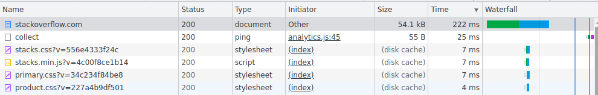
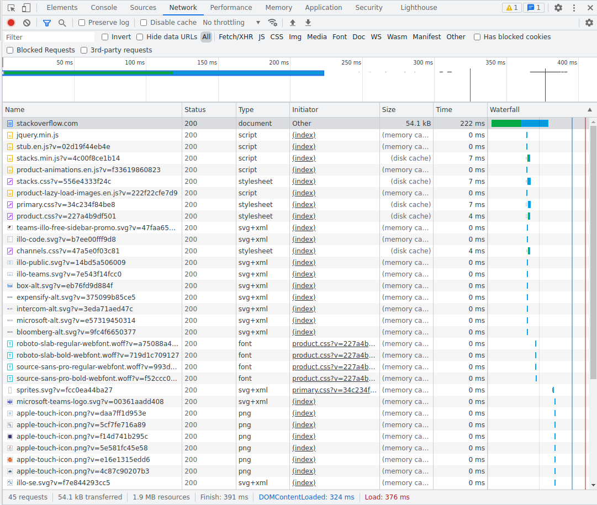

# 3.6. Компьютерные сети, лекция 1 - Дмитрий Щербаков
### 1. Работа c HTTP через телнет.
### - Подключитесь утилитой телнет к сайту stackoverflow.com telnet stackoverflow.com 80
### - отправьте HTTP запрос
```
GET /questions HTTP/1.0
HOST: stackoverflow.com
[press enter]
[press enter]
```
### - В ответе укажите полученный HTTP код, что он означает?
```commandline
vagrant@vagrant:~$ telnet stackoverflow.com 80
Trying 151.101.129.69...
Connected to stackoverflow.com.
Escape character is '^]'.
GET /questions HTTP/1.0
HOST: stackoverflow.com

HTTP/1.1 301 Moved Permanently
cache-control: no-cache, no-store, must-revalidate
location: https://stackoverflow.com/questions
x-request-guid: e2c37e67-55db-4037-9d1b-dbe27f630b24
feature-policy: microphone 'none'; speaker 'none'
content-security-policy: upgrade-insecure-requests; frame-ancestors 'self' https://stackexchange.com
Accept-Ranges: bytes
Date: Sun, 28 Nov 2021 07:08:44 GMT
Via: 1.1 varnish
Connection: close
X-Served-By: cache-bma1640-BMA
X-Cache: MISS
X-Cache-Hits: 0
X-Timer: S1638083325.769373,VS0,VE101
Vary: Fastly-SSL
X-DNS-Prefetch-Control: off
Set-Cookie: prov=8fe05d96-9603-427e-efdf-3a909298ce12; domain=.stackoverflow.com; expires=Fri, 01-Jan-2055 00:00:00 GMT; path=/; HttpOnly

Connection closed by foreign host.
```
В приведенном выводе:
* **HTTP/1.1 301 Moved Permanently** - ошибка из группы перенаправлений, сообщающая о том, что сайт перемещен на постоянной основе (адрес нового расположения указывается в поле Location).
* **cache-control: no-cache, no-store, must-revalidate** - пареметры кэширования. Здесь:
  - `no-cache` - параметр, указывающий на то, что требуется проверка актуальности имеющейся копии из кэша перед ее использованием. Можно использовать cache-control: no-cache, чтобы указать браузеру сначала проверить ресурс на сервере, и если «свежей» версии нет (статус 304), использовать кэшированную версию. Если же сервер предложит свежий контент, он пришлет ответ со статусом 200 и новый файл;
  - `no-store` - строгая директива, не позволяет хранить информацию в любом кэше;
  - `must-revalidate` - Говорит, что каждый запрос нужно делать заново, и ни при каких условиях не предоставлять пользователю закешированный контент. Имеет преимущество над всеми другими директивами, которые разрешают кэширование. При использовании с `max-age`, директивы устанавливают время, в течение которого данные в кэше будут считаться актуальными;
* **location: https://stackoverflow.com/questions** - в случае, когда сопоставлен с кодом 3xx, предлагает браузеру загрузить другую страницу (осуществляет перенаправление);
* **x-request-guid: e2c37e67-55db-4037-9d1b-dbe27f630b24** - опциональный параметр, который задает уникальный идентификатор клиента, используемый далее в маркировке событий в журнале, что позволяет впоследствии осуществить анализ взаимодействия и локализовать сбой, если это потребуется;
* **feature-policy: microphone 'none'; speaker 'none'** - заголовок, позволяющий управлять возможностями браузера. Здесь:
  - `microphone 'none'` - блокирует использование микрофона на странице;
  - `speaker 'none'` - блокирует использование устройств вывода звука;
* content-security-policy: upgrade-insecure-requests; frame-ancestors 'self' https://stackexchange.com - механизм обеспечения безопасности, с помощью которого можно защищаться от атак с внедрением контента, например, межсайтового скриптинга (XSS, cross site scripting). Здесь:
  - `upgrade-insecure-requests` - указывает на то, что URL-адреса содержимого из небезопасных (HTTP) источников должны быть безопасно получены по протоколу HTTPS;
  - `frame-ancestors 'self' https://stackexchange.com` - указывает каким образом должен встраиваться ресурс на страницу (допустимых родителей). В указанном примере, сайт может быть загружен только внутри фреймов `self` (самого себя) либо `https://stackexchange.com`;
* **Accept-Ranges: bytes** - маркер, который использует сервер, чтобы уведомить клиента о поддержке "запросов по кускам". Его значение указывает единицу измерения, которая может быть использована для определения диапазона чтения. При наличии заголовка Accept-Ranges, браузер может попытаться возобновить прерванную загрузку, а не запускать её с самого начала. При использовании `bytes`,
единицей измерения для диапазона являются байты;
* **Date: Sun, 28 Nov 2021 07:08:44 GMT** - данный заголовок содержит дату и время формирования ответа на запрос;
* **Via: 1.1 varnish** - заголовок `Via` добавляется прокси-серверами. В нашем случае, содержит версию протокола (1.1) и имя (название) прокси-сервера `varnish`;
* **Connection: close** - заголовок определяет, остаётся ли сетевое соединение активным после завершения текущей транзакции (запроса). `close` указывает, что клиент или сервер хотели бы закрыть соединение. Это значение по умолчанию для запросов HTTP/1.0.
* **X-Served-By: cache-bma1640-BMA** - нестандартный заголовок, внедренный сервисом Fastly для идентификации кэширующего сервера, сформировавшего ответ. Данные представляются в формате: `cache-{datacenter}{nodeid}-{datacenter}`;
* **X-Cache: MISS** - нестандартный заголовок, внедренный сервисом Fastly. Сообщает, предоставил ли прокси ответ на запрос из кэша (`HIT`) или нет (`MISS`);
* **X-Cache-Hits: 0** - нестандартный заголовок, внедренный сервисом Fastly. Указывает сколько раз данный объект был прочитан из кэша текущего кэширующего сервера;
* **X-Timer: S1638083325.769373,VS0,VE101** - нестандартный заголовок, внедренный сервисом Fastly. Содержит параметры времени взаимодействия в формате: `S{unixStartTimeSeconds},VS0,VE{durationMilliseconds}`, где `{unixStartTimeSeconds}` - время начала взаимодействия в формате unixtime; `{durationMilliseconds}` - время, затраченное на формирование запроса в мс.
* **Vary: Fastly-SSL** - параметр определяет выбор какого-либо из множественных вариантов ресурса в кэше, привязанных к одному и тому же имени. Может использоваться для корректного выбора языка страницы или форматирования в зависимости от используемого устройства.
* **X-DNS-Prefetch-Control: off** - включает и отключает предварительное разрешение браузером DNS имен внешних ресурсов, которые используются на сайте.
* **Set-Cookie: prov=8fe05d96-9603-427e-efdf-3a909298ce12; domain=.stackoverflow.com; expires=Fri, 01-Jan-2055 00:00:00 GMT; path=/; HttpOnly** - заголовок используется для отправки cookies с сервера на агент пользователя. Здесь:
  * `prov=...` - имя и значение cookie;
  * `domain=.stackoverflow.com;` - хост, на который будет отправляться cookie;
  * `expires=...` - максимальное время жизни cookie;
  * `path=/` - путь, который должен существовать в запрошенном URL, иначе браузер не отправит заголовок Cookie. `/` - cookie будет отправляться со всеми запросами;
  * `HttpOnly` - запрещает JavaScript доступ к cookie.

### 2. Повторите задание 1 в браузере, используя консоль разработчика F12.
### * откройте вкладку Network
### * отправьте запрос http://stackoverflow.com
### * найдите первый ответ HTTP сервера, откройте вкладку Headers
### * укажите в ответе полученный HTTP код.
```commandline
Request URL: https://stackoverflow.com/
Request Method: GET
Status Code: 200 
Remote Address: 151.101.193.69:443
Referrer Policy: strict-origin-when-cross-origin
accept-ranges: bytes
cache-control: private
content-encoding: gzip
content-security-policy: upgrade-insecure-requests; frame-ancestors 'self' https://stackexchange.com
content-type: text/html; charset=utf-8
date: Sun, 28 Nov 2021 09:45:22 GMT
feature-policy: microphone 'none'; speaker 'none'
strict-transport-security: max-age=15552000
vary: Accept-Encoding,Fastly-SSL
via: 1.1 varnish
x-cache: MISS
x-cache-hits: 0
x-dns-prefetch-control: off
x-frame-options: SAMEORIGIN
x-request-guid: ce899dc7-0215-4517-ad73-55f9e54ce4d0
x-served-by: cache-bma1625-BMA
x-timer: S1638092723.683961,VS0,VE104
:authority: stackoverflow.com
:method: GET
:path: /
:scheme: https
accept: text/html,application/xhtml+xml,application/xml;q=0.9,image/avif,image/webp,image/apng,*/*;q=0.8,application/signed-exchange;v=b3;q=0.9
accept-encoding: gzip, deflate, br
accept-language: ru-RU,ru;q=0.9,en-US;q=0.8,en;q=0.7
cache-control: max-age=0
cookie: prov=cadb72e6-63f0-8da7-155b-c920a59db0f9; _ga=GA1.2.1303728821.1634973584; _gid=GA1.2.1405329358.1638089089; _gat=1
sec-ch-ua: "Chromium";v="95", ";Not A Brand";v="99"
sec-ch-ua-mobile: ?0
sec-ch-ua-platform: "Linux"
sec-fetch-dest: document
sec-fetch-mode: navigate
sec-fetch-site: none
sec-fetch-user: ?1
upgrade-insecure-requests: 1
user-agent: Mozilla/5.0 (X11; Linux x86_64) AppleWebKit/537.36 (KHTML, like Gecko) Chrome/95.0.4638.69 Safari/537.36
```
### * проверьте время загрузки страницы, какой запрос обрабатывался дольше всего?
Время загрузки страницы составило 222,34мс. Дольше всего происходило ожидание ответа (первого байта) `Waiting (TTFB)` - 116,93мс, и скачивание контента - 103,84мс. Краткий "Топ" продолжительности обработки запросов представлен ниже:


### * приложите скриншот консоли браузера в ответ.
Консоль выглядит следующим образом:


### 3. Какой IP адрес у вас в интернете?
```commandline
$ curl ifconfig.co
94.124.179.173
```

### 4. Какому провайдеру принадлежит ваш IP адрес? Какой автономной системе AS? Воспользуйтесь утилитой `whois`
```commandline
$ whois 94.124.179.173
...
% Information related to '94.124.178.0/23AS42065'

route:          94.124.178.0/23
origin:         AS42065
descr:          ETelecom_Customers
mnt-by:         MNT-GLOBAL-NET
created:        2018-10-23T07:50:42Z
last-modified:  2018-10-23T07:50:42Z
source:         RIPE

% This query was served by the RIPE Database Query Service version 1.101 (ANGUS)
```
Из вывода, представленного выше, видно, что имя моего провайдера - ETelecom_Customers, идентификатор автономной системы - AS42065.

### 5. Через какие сети проходит пакет, отправленный с вашего компьютера на адрес 8.8.8.8? Через какие AS? Воспользуйтесь утилитой `traceroute`
Результат работы команды `traceroute` представлен ниже:
```commandline
$ traceroute -nA 8.8.8.8
traceroute to 8.8.8.8 (8.8.8.8), 30 hops max, 60 byte packets
 1  192.168.0.1 [*]  0.526 ms  0.553 ms  0.609 ms
 2  94.124.179.161 [AS42065]  1.165 ms  1.182 ms  1.242 ms
 3  * * *
 4  10.11.12.0 [*]  2.384 ms  2.426 ms  2.775 ms
 5  10.11.12.5 [*]  2.661 ms  2.678 ms  2.692 ms
 6  109.239.128.186 [AS31500]  2.789 ms  1.931 ms  1.994 ms
 7  91.108.51.3 [AS31500]  2.295 ms 91.108.51.1 [AS31500]  11.211 ms  13.270 ms
 8  178.18.227.7 [AS50952]  12.498 ms  12.539 ms  12.495 ms
 9  108.170.250.34 [AS15169]  12.786 ms * 108.170.250.66 [AS15169]  13.055 ms
10  * * 209.85.249.158 [AS15169]  18.022 ms
11  216.239.48.163 [AS15169]  6.178 ms 108.170.235.64 [AS15169]  18.803 ms 142.251.61.219 [AS15169]  6.824 ms
12  72.14.235.193 [AS15169]  16.723 ms 108.170.233.161 [AS15169]  14.844 ms 216.239.46.139 [AS15169]  16.179 ms
13  * * *
14  * * *
15  * * *
16  * * *
17  * * *
18  * * *
19  * * *
20  * * *
21  * 8.8.8.8 [AS15169]  6.163 ms *
```

### 6. Повторите задание 5 в утилите mtr. На каком участке наибольшая задержка - delay?
Вывод команды `mtr` представлен ниже:
```commandline
$ mtr -zn 8.8.8.8 -r -c 1
Start: 2021-11-28T13:33:04+0300
HOST: dmhome                      Loss%   Snt   Last   Avg  Best  Wrst StDev
  1. AS???    192.168.0.1          0.0%     1    0.5   0.5   0.5   0.5   0.0
  2. AS42065  94.124.179.161       0.0%     1    1.0   1.0   1.0   1.0   0.0
  3. AS???    ???                 100.0     1    0.0   0.0   0.0   0.0   0.0
  4. AS???    10.11.12.0           0.0%     1    1.9   1.9   1.9   1.9   0.0
  5. AS???    10.11.12.5           0.0%     1    1.6   1.6   1.6   1.6   0.0
  6. AS31500  109.239.128.186      0.0%     1    1.7   1.7   1.7   1.7   0.0
  7. AS31500  91.108.51.2          0.0%     1   11.0  11.0  11.0  11.0   0.0
  8. AS???    178.18.227.7         0.0%     1   12.5  12.5  12.5  12.5   0.0
  9. AS15169  108.170.250.34       0.0%     1   12.2  12.2  12.2  12.2   0.0
 10. AS15169  142.251.49.24        0.0%     1   15.0  15.0  15.0  15.0   0.0
 11. AS15169  209.85.254.20        0.0%     1   14.4  14.4  14.4  14.4   0.0
 12. AS15169  142.250.57.5         0.0%     1   14.7  14.7  14.7  14.7   0.0
 13. AS???    ???                 100.0     1    0.0   0.0   0.0   0.0   0.0
 14. AS???    ???                 100.0     1    0.0   0.0   0.0   0.0   0.0
 15. AS???    ???                 100.0     1    0.0   0.0   0.0   0.0   0.0
 16. AS???    ???                 100.0     1    0.0   0.0   0.0   0.0   0.0
 17. AS???    ???                 100.0     1    0.0   0.0   0.0   0.0   0.0
 18. AS???    ???                 100.0     1    0.0   0.0   0.0   0.0   0.0
 19. AS???    ???                 100.0     1    0.0   0.0   0.0   0.0   0.0
 20. AS???    ???                 100.0     1    0.0   0.0   0.0   0.0   0.0
 21. AS???    ???                 100.0     1    0.0   0.0   0.0   0.0   0.0
 22. AS???    ???                 100.0     1    0.0   0.0   0.0   0.0   0.0
 23. AS???    ???                 100.0     1    0.0   0.0   0.0   0.0   0.0
 24. AS15169  8.8.8.8              0.0%     1   13.6  13.6  13.6  13.6   0.0
```
Здесь видно, что наибольшая усредненная задержка (Avg RTT) и наихудшее время (Wrst RTT) выявляется на 10-м "хопе" (142.251.49.24, AS15169) - 15мс.

### 7. Какие DNS сервера отвечают за доменное имя dns.google? Какие A записи? Воспользуйтесь утилитой `dig`
Определить серверы, ответственные за какую-либо зону, можно следующими командами: 
```commandline
$ dig ns +short dns.google
ns4.zdns.google.
ns3.zdns.google.
ns1.zdns.google.
ns2.zdns.google.

$ host -t ns dns.google
dns.google name server ns1.zdns.google.
dns.google name server ns2.zdns.google.
dns.google name server ns4.zdns.google.
dns.google name server ns3.zdns.google.

$ nslookup 
> set q=ns
> dns.google
Server:		127.0.0.53
Address:	127.0.0.53#53

Non-authoritative answer:
dns.google	nameserver = ns2.zdns.google.
dns.google	nameserver = ns4.zdns.google.
dns.google	nameserver = ns1.zdns.google.
dns.google	nameserver = ns3.zdns.google.

Authoritative answers can be found from:
> exit
```
Определяем A-записи для указанных хостов:
```commandline
$ dig ns +short dns.google > dig.file && dig a +short -f dig.file
216.239.36.114
216.239.32.114
216.239.38.114
216.239.34.114
```

### 8. Проверьте PTR записи для IP адресов из задания 7. Какое доменное имя привязано к IP? воспользуйтесь утилитой `dig`
Воспользуемся следующей конструкцией:
```commandline
dimka@dmhome:~$ dig ns +short dns.google > dig.file && dig a +short -f dig.file > ip.file 
dimka@dmhome:~$ cat ip.file 
216.239.36.114
216.239.32.114
216.239.38.114
216.239.34.114
dimka@dmhome:~$ cat ip.file | while read addr; do dig -x $addr +short; done
ns3.zdns.google.
ns1.zdns.google.
ns4.zdns.google.
ns2.zdns.google.
```
