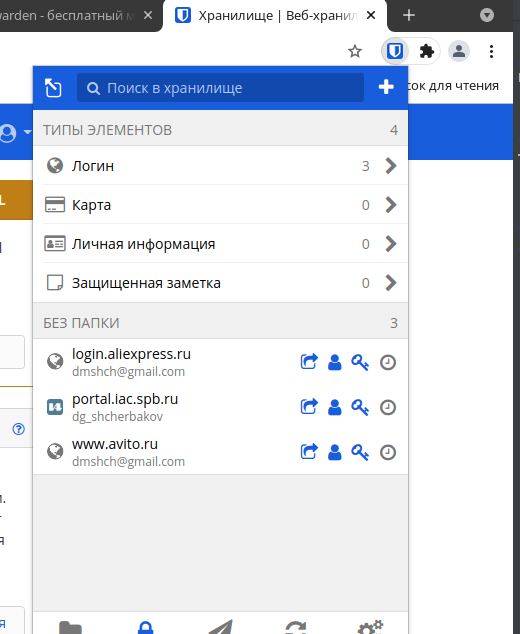
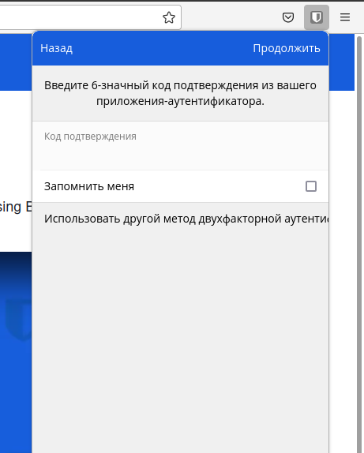
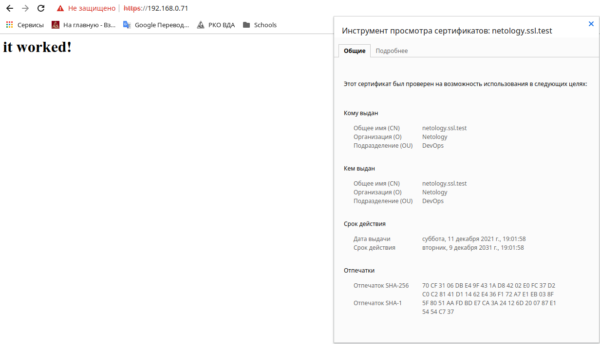
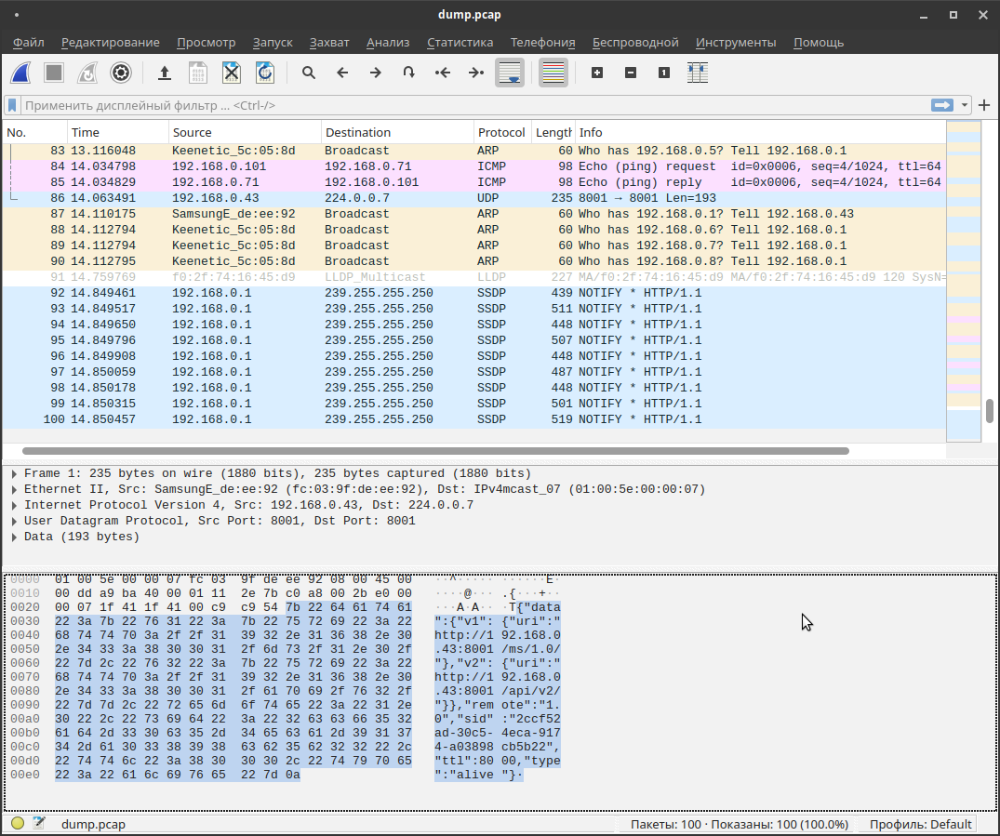

# 3.9. Элементы безопасности информационных систем - Дмитрий Щербаков
### 1. Установите Bitwarden плагин для браузера. Зарегестрируйтесь и сохраните несколько паролей.


### 2. Установите Google authenticator на мобильный телефон. Настройте вход в Bitwarden акаунт через Google authenticator OTP.


### 3. Установите apache2, сгенерируйте самоподписанный сертификат, настройте тестовый сайт для работы по HTTPS.
```commandline
root@vagrant:~# apt update
Get:1 http://security.ubuntu.com/ubuntu focal-security InRelease [114 kB]
...
Fetched 8783 kB in 3s (2555 kB/s)                                      
Reading package lists... Done
Building dependency tree       
Reading state information... Done
107 packages can be upgraded. Run 'apt list --upgradable' to see them.
root@vagrant:~# apt install apache2
Reading package lists... Done
Building dependency tree       
Reading state information... Done
The following additional packages will be installed:
  apache2-bin apache2-data apache2-utils libapr1 libaprutil1 libaprutil1-dbd-sqlite3 libaprutil1-ldap libjansson4 liblua5.2-0 ssl-cert
Suggested packages:
  apache2-doc apache2-suexec-pristine | apache2-suexec-custom www-browser openssl-blacklist
The following NEW packages will be installed:
  apache2 apache2-bin apache2-data apache2-utils libapr1 libaprutil1 libaprutil1-dbd-sqlite3 libaprutil1-ldap libjansson4 liblua5.2-0 ssl-cert
0 upgraded, 11 newly installed, 0 to remove and 107 not upgraded.
...
root@vagrant:~# sudo openssl req -x509 -nodes -days 3650 -newkey rsa:2048 -keyout /etc/ssl/private/apache-selfsigned.key -out /etc/ssl/certs/apache-selfsigned.crt -subj "/C=RU/ST=Saint-Petersburg/L=Saint-Petersburg/O=Netology/OU=DevOps/CN=netology.ssl.test"
Generating a RSA private key
...............+++++
..............................+++++
writing new private key to '/etc/ssl/private/apache-selfsigned.key'
-----
root@vagrant:~# cat /etc/apache2/sites-available/netology.ssl.test.conf
<VirtualHost *:443>
   ServerName netology.ssl.test
   DocumentRoot /var/www/netology_ssl
   SSLEngine on
   SSLCertificateFile /etc/ssl/certs/apache-selfsigned.crt
   SSLCertificateKeyFile /etc/ssl/private/apache-selfsigned.key
</VirtualHost>

root@vagrant:~# mkdir /var/www/netology_ssl
root@vagrant:~# cat /var/www/netology_ssl/index.html
<h1>it worked!</h1>

root@vagrant:~# sudo a2enmod ssl
Considering dependency setenvif for ssl:
Module setenvif already enabled
Considering dependency mime for ssl:
Module mime already enabled
Considering dependency socache_shmcb for ssl:
Enabling module socache_shmcb.
Enabling module ssl.
See /usr/share/doc/apache2/README.Debian.gz on how to configure SSL and create self-signed certificates.
To activate the new configuration, you need to run:
  systemctl restart apache2
root@vagrant:~# sudo a2ensite netology.ssl.test.conf
Enabling site netology.ssl.test.
To activate the new configuration, you need to run:
  systemctl reload apache2
root@vagrant:~# sudo apache2ctl configtest
Syntax OK
root@vagrant:~# sudo systemctl restart apache2
root@vagrant:~# sudo systemctl status apache2
● apache2.service - The Apache HTTP Server
     Loaded: loaded (/lib/systemd/system/apache2.service; enabled; vendor preset: enabled)
     Active: active (running) since Sat 2021-12-11 16:08:09 UTC; 6s ago
       Docs: https://httpd.apache.org/docs/2.4/
    Process: 13999 ExecStart=/usr/sbin/apachectl start (code=exited, status=0/SUCCESS)
   Main PID: 14014 (apache2)
      Tasks: 55 (limit: 1071)
     Memory: 6.0M
     CGroup: /system.slice/apache2.service
             ├─14014 /usr/sbin/apache2 -k start
             ├─14015 /usr/sbin/apache2 -k start
             └─14016 /usr/sbin/apache2 -k start

Dec 11 16:08:09 vagrant systemd[1]: Starting The Apache HTTP Server...
Dec 11 16:08:09 vagrant systemd[1]: Started The Apache HTTP Server.
vagrant@vagrant:~$ ip -br a s
lo               UNKNOWN        127.0.0.1/8 ::1/128 
eth0             UP             10.0.2.15/24 fe80::a00:27ff:fe73:60cf/64 
eth1             UP             192.168.0.71/24 fe80::a00:27ff:fe9e:7d96/64 
```

В браузере:


### 4. Проверьте на TLS уязвимости произвольный сайт в интернете (кроме сайтов МВД, ФСБ, МинОбр, НацБанк, РосКосмос, РосАтом, РосНАНО и любых госкомпаний, объектов КИИ, ВПК ... и тому подобное).
```commandline
vagrant@vagrant:~$ git clone --depth 1 https://github.com/drwetter/testssl.sh.git
Cloning into 'testssl.sh'...
remote: Enumerating objects: 100, done.
remote: Counting objects: 100% (100/100), done.
remote: Compressing objects: 100% (93/93), done.
remote: Total 100 (delta 14), reused 40 (delta 6), pack-reused 0
Receiving objects: 100% (100/100), 8.55 MiB | 5.69 MiB/s, done.
Resolving deltas: 100% (14/14), done.
vagrant@vagrant:~$ cd testssl.sh/
vagrant@vagrant:~/testssl.sh$ ./testssl.sh -U --sneaky https://netology.ru

###########################################################
    testssl.sh       3.1dev from https://testssl.sh/dev/
    (6da72bc 2021-12-10 20:16:28 -- )

      This program is free software. Distribution and
             modification under GPLv2 permitted.
      USAGE w/o ANY WARRANTY. USE IT AT YOUR OWN RISK!

       Please file bugs @ https://testssl.sh/bugs/

###########################################################

 Using "OpenSSL 1.0.2-chacha (1.0.2k-dev)" [~183 ciphers]
 on vagrant:./bin/openssl.Linux.x86_64
 (built: "Jan 18 17:12:17 2019", platform: "linux-x86_64")


Testing all IPv4 addresses (port 443): 104.22.40.171 104.22.41.171 172.67.21.207
------------------------------------------------------------------------------------------------------------------------------------------------------------------------------------
 Start 2021-12-11 16:36:41        -->> 104.22.40.171:443 (netology.ru) <<--

 Further IP addresses:   172.67.21.207 104.22.41.171 2606:4700:10::ac43:15cf 2606:4700:10::6816:28ab 2606:4700:10::6816:29ab 
 rDNS (104.22.40.171):   --
 Service detected:       HTTP


 Testing vulnerabilities 

 Heartbleed (CVE-2014-0160)                not vulnerable (OK), no heartbeat extension
 CCS (CVE-2014-0224)                       not vulnerable (OK)
 Ticketbleed (CVE-2016-9244), experiment.  not vulnerable (OK), no session tickets
 ROBOT                                     not vulnerable (OK)
 Secure Renegotiation (RFC 5746)           OpenSSL handshake didn't succeed
 Secure Client-Initiated Renegotiation     not vulnerable (OK)
 CRIME, TLS (CVE-2012-4929)                not vulnerable (OK)
 BREACH (CVE-2013-3587)                    potentially NOT ok, "gzip" HTTP compression detected. - only supplied "/" tested
                                           Can be ignored for static pages or if no secrets in the page
 POODLE, SSL (CVE-2014-3566)               not vulnerable (OK)
 TLS_FALLBACK_SCSV (RFC 7507)              Downgrade attack prevention supported (OK)
 SWEET32 (CVE-2016-2183, CVE-2016-6329)    VULNERABLE, uses 64 bit block ciphers
 FREAK (CVE-2015-0204)                     not vulnerable (OK)
 DROWN (CVE-2016-0800, CVE-2016-0703)      not vulnerable on this host and port (OK)
                                           make sure you don't use this certificate elsewhere with SSLv2 enabled services
                                           https://censys.io/ipv4?q=0E745E5E77A60345EB6E6B33B99A36286C2203D687F3377FBC685B2434518C53 could help you to find out
 LOGJAM (CVE-2015-4000), experimental      not vulnerable (OK): no DH EXPORT ciphers, no DH key detected with <= TLS 1.2
 BEAST (CVE-2011-3389)                     TLS1: ECDHE-RSA-AES128-SHA AES128-SHA ECDHE-RSA-AES256-SHA AES256-SHA DES-CBC3-SHA 
                                           VULNERABLE -- but also supports higher protocols  TLSv1.1 TLSv1.2 (likely mitigated)
 LUCKY13 (CVE-2013-0169), experimental     potentially VULNERABLE, uses cipher block chaining (CBC) ciphers with TLS. Check patches
 Winshock (CVE-2014-6321), experimental    not vulnerable (OK)
 RC4 (CVE-2013-2566, CVE-2015-2808)        no RC4 ciphers detected (OK)


 Done 2021-12-11 16:37:13 [  34s] -->> 104.22.40.171:443 (netology.ru) <<--

------------------------------------------------------------------------------------------------------------------------------------------------------------------------------------
 Start 2021-12-11 16:37:13        -->> 104.22.41.171:443 (netology.ru) <<--

 Further IP addresses:   172.67.21.207 104.22.40.171 2606:4700:10::ac43:15cf 2606:4700:10::6816:28ab 2606:4700:10::6816:29ab 
 rDNS (104.22.41.171):   --
 Service detected:       HTTP


 Testing vulnerabilities 

 Heartbleed (CVE-2014-0160)                not vulnerable (OK), no heartbeat extension
 CCS (CVE-2014-0224)                       not vulnerable (OK)
 Ticketbleed (CVE-2016-9244), experiment.  not vulnerable (OK), no session tickets
 ROBOT                                     not vulnerable (OK)
 Secure Renegotiation (RFC 5746)           OpenSSL handshake didn't succeed
 Secure Client-Initiated Renegotiation     not vulnerable (OK)
 CRIME, TLS (CVE-2012-4929)                not vulnerable (OK)
 BREACH (CVE-2013-3587)                    potentially NOT ok, "gzip" HTTP compression detected. - only supplied "/" tested
                                           Can be ignored for static pages or if no secrets in the page
 POODLE, SSL (CVE-2014-3566)               not vulnerable (OK)
 TLS_FALLBACK_SCSV (RFC 7507)              Downgrade attack prevention supported (OK)
 SWEET32 (CVE-2016-2183, CVE-2016-6329)    VULNERABLE, uses 64 bit block ciphers
 FREAK (CVE-2015-0204)                     not vulnerable (OK)
 DROWN (CVE-2016-0800, CVE-2016-0703)      not vulnerable on this host and port (OK)
                                           make sure you don't use this certificate elsewhere with SSLv2 enabled services
                                           https://censys.io/ipv4?q=0E745E5E77A60345EB6E6B33B99A36286C2203D687F3377FBC685B2434518C53 could help you to find out
 LOGJAM (CVE-2015-4000), experimental      not vulnerable (OK): no DH EXPORT ciphers, no DH key detected with <= TLS 1.2
 BEAST (CVE-2011-3389)                     TLS1: ECDHE-RSA-AES128-SHA AES128-SHA ECDHE-RSA-AES256-SHA AES256-SHA DES-CBC3-SHA 
                                           VULNERABLE -- but also supports higher protocols  TLSv1.1 TLSv1.2 (likely mitigated)
 LUCKY13 (CVE-2013-0169), experimental     potentially VULNERABLE, uses cipher block chaining (CBC) ciphers with TLS. Check patches
 Winshock (CVE-2014-6321), experimental    not vulnerable (OK)
 RC4 (CVE-2013-2566, CVE-2015-2808)        no RC4 ciphers detected (OK)


 Done 2021-12-11 16:37:45 [  66s] -->> 104.22.41.171:443 (netology.ru) <<--

------------------------------------------------------------------------------------------------------------------------------------------------------------------------------------
 Start 2021-12-11 16:37:45        -->> 172.67.21.207:443 (netology.ru) <<--

 Further IP addresses:   104.22.41.171 104.22.40.171 2606:4700:10::ac43:15cf 2606:4700:10::6816:28ab 2606:4700:10::6816:29ab 
 rDNS (172.67.21.207):   --
 Service detected:       HTTP


 Testing vulnerabilities 

 Heartbleed (CVE-2014-0160)                not vulnerable (OK), no heartbeat extension
 CCS (CVE-2014-0224)                       not vulnerable (OK)
 Ticketbleed (CVE-2016-9244), experiment.  not vulnerable (OK), no session tickets
 ROBOT                                     not vulnerable (OK)
 Secure Renegotiation (RFC 5746)           OpenSSL handshake didn't succeed
 Secure Client-Initiated Renegotiation     not vulnerable (OK)
 CRIME, TLS (CVE-2012-4929)                not vulnerable (OK)
 BREACH (CVE-2013-3587)                    potentially NOT ok, "gzip" HTTP compression detected. - only supplied "/" tested
                                           Can be ignored for static pages or if no secrets in the page
 POODLE, SSL (CVE-2014-3566)               not vulnerable (OK)
 TLS_FALLBACK_SCSV (RFC 7507)              Downgrade attack prevention supported (OK)
 SWEET32 (CVE-2016-2183, CVE-2016-6329)    VULNERABLE, uses 64 bit block ciphers
 FREAK (CVE-2015-0204)                     not vulnerable (OK)
 DROWN (CVE-2016-0800, CVE-2016-0703)      not vulnerable on this host and port (OK)
                                           make sure you don't use this certificate elsewhere with SSLv2 enabled services
                                           https://censys.io/ipv4?q=0E745E5E77A60345EB6E6B33B99A36286C2203D687F3377FBC685B2434518C53 could help you to find out
 LOGJAM (CVE-2015-4000), experimental      not vulnerable (OK): no DH EXPORT ciphers, no DH key detected with <= TLS 1.2
 BEAST (CVE-2011-3389)                     TLS1: ECDHE-RSA-AES128-SHA AES128-SHA ECDHE-RSA-AES256-SHA AES256-SHA DES-CBC3-SHA 
                                           VULNERABLE -- but also supports higher protocols  TLSv1.1 TLSv1.2 (likely mitigated)
 LUCKY13 (CVE-2013-0169), experimental     potentially VULNERABLE, uses cipher block chaining (CBC) ciphers with TLS. Check patches
 Winshock (CVE-2014-6321), experimental    not vulnerable (OK)
 RC4 (CVE-2013-2566, CVE-2015-2808)        no RC4 ciphers detected (OK)


 Done 2021-12-11 16:38:16 [  97s] -->> 172.67.21.207:443 (netology.ru) <<--

------------------------------------------------------------------------------------------------------------------------------------------------------------------------------------
Done testing now all IP addresses (on port 443): 104.22.40.171 104.22.41.171 172.67.21.207
```

### 5. Установите на Ubuntu ssh сервер, сгенерируйте новый приватный ключ. Скопируйте свой публичный ключ на другой сервер. Подключитесь к серверу по SSH-ключу.
```commandline
vagrant@vagrant:~$ dpkg -l | grep ssh-server
ii  openssh-server                       1:8.2p1-4ubuntu0.2                amd64        secure shell (SSH) server, for secure access from remote machines
vagrant@vagrant:~$ ssh-keygen 
Generating public/private rsa key pair.
Enter file in which to save the key (/home/vagrant/.ssh/id_rsa): 
Enter passphrase (empty for no passphrase): 
Enter same passphrase again: 
Your identification has been saved in /home/vagrant/.ssh/id_rsa
Your public key has been saved in /home/vagrant/.ssh/id_rsa.pub
The key fingerprint is:
SHA256:iGeCQiPTt5qDUEPkILCCxkVvBcg+X55i6Dpd2jHh9/0 vagrant@vagrant
The key's randomart image is:
+---[RSA 3072]----+
|=.=o....         |
|+*.o. .          |
|*=* .o           |
|=o.*.+ o         |
|o . O B S        |
|.o + % +         |
|. * = = . .      |
| . = .   . .     |
| .o         .E   |
+----[SHA256]-----+
vagrant@vagrant:~$ ssh-copy-id dimka@192.168.0.101
/usr/bin/ssh-copy-id: INFO: Source of key(s) to be installed: "/home/vagrant/.ssh/id_rsa.pub"
The authenticity of host '192.168.0.101 (192.168.0.101)' can't be established.
ECDSA key fingerprint is SHA256:s/deQ3WF0rQgzuITqzxFsyve4wMGtYwTtwDQ4ER0KD8.
Are you sure you want to continue connecting (yes/no/[fingerprint])? yes
/usr/bin/ssh-copy-id: INFO: attempting to log in with the new key(s), to filter out any that are already installed
/usr/bin/ssh-copy-id: INFO: 1 key(s) remain to be installed -- if you are prompted now it is to install the new keys
dimka@192.168.0.101's password: 

Number of key(s) added: 1

Now try logging into the machine, with:   "ssh 'dimka@192.168.0.101'"
and check to make sure that only the key(s) you wanted were added.

vagrant@vagrant:~$ ssh dimka@192.168.0.101
Welcome to Ubuntu 20.04.3 LTS (GNU/Linux 5.4.0-91-lowlatency x86_64)

 * Documentation:  https://help.ubuntu.com
 * Management:     https://landscape.canonical.com
 * Support:        https://ubuntu.com/advantage

21 updates can be applied immediately.
Чтобы просмотреть дополнительные обновления выполните: apt list --upgradable

Last login: Wed Dec  8 08:44:38 2021 from 10.9.0.10
dimka@dmhome:~$ 
```

### 6. Переименуйте файлы ключей из задания 5. Настройте файл конфигурации SSH клиента, так чтобы вход на удаленный сервер осуществлялся по имени сервера.
```commandline
vagrant@vagrant:~$ cd .ssh/
vagrant@vagrant:~/.ssh$ ls
authorized_keys  id_rsa  id_rsa.pub  known_hosts
vagrant@vagrant:~/.ssh$ mv id_rsa dm_rsa
vagrant@vagrant:~/.ssh$ mv id_rsa.pub dm_rsa.pub
vagrant@vagrant:~/.ssh$ touch config
vagrant@vagrant:~/.ssh$ ls
authorized_keys  config  dm_rsa  dm_rsa.pub  known_hosts
vagrant@vagrant:~/.ssh$ cat config 
Host dmhome
        Hostname 192.168.0.101
        User dimka
       	IdentityFile ~/.ssh/dm_rsa
vagrant@vagrant:~/.ssh$ ssh dmhome
Welcome to Ubuntu 20.04.3 LTS (GNU/Linux 5.4.0-91-lowlatency x86_64)

 * Documentation:  https://help.ubuntu.com
 * Management:     https://landscape.canonical.com
 * Support:        https://ubuntu.com/advantage

21 updates can be applied immediately.
Чтобы просмотреть дополнительные обновления выполните: apt list --upgradable

Last login: Sat Dec 11 19:58:01 2021 from 192.168.0.71
dimka@dmhome:~$
```

### 7.Соберите дамп трафика утилитой tcpdump в формате pcap, 100 пакетов. Откройте файл pcap в Wireshark.
```commandline
vagrant@vagrant:~$ sudo tcpdump -i eth1 -c 100 -w dump.pcap
tcpdump: listening on eth1, link-type EN10MB (Ethernet), capture size 262144 bytes
100 packets captured
102 packets received by filter
0 packets dropped by kernel
vagrant@vagrant:~$ scp dump.pcap dmhome:
dump.pcap                                                 100%   18KB  12.9MB/s   00:00    
```

