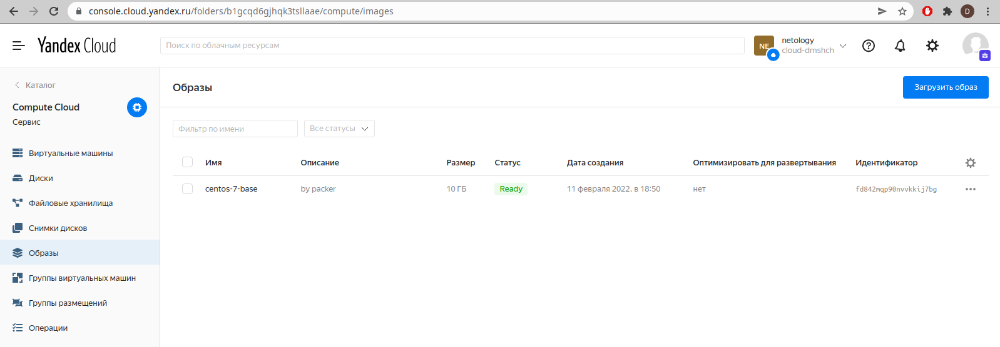
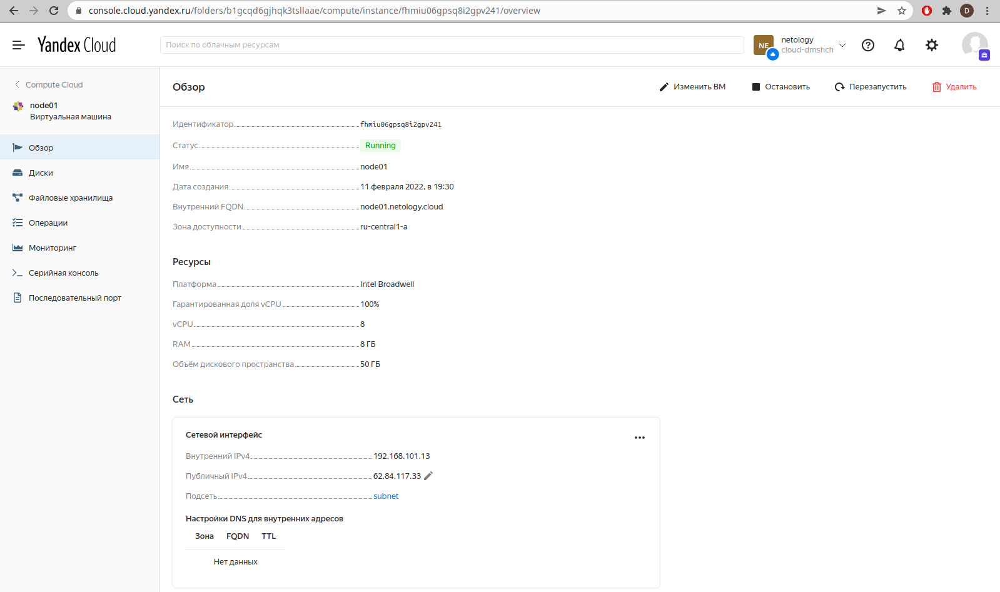
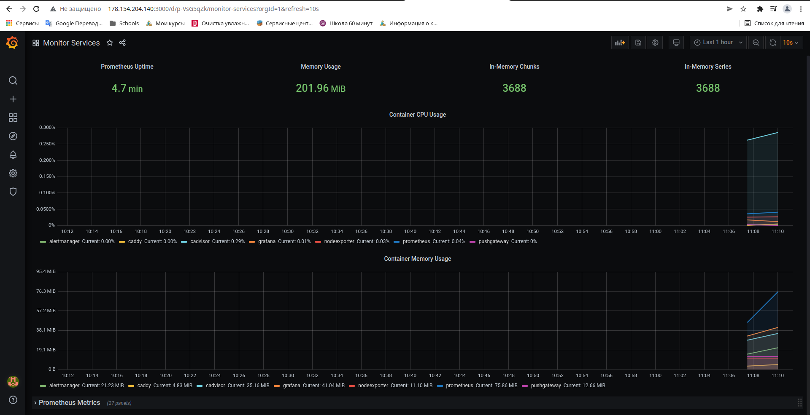

# Домашнее задание к занятию "5.4. Оркестрация группой Docker контейнеров на примере Docker Compose" - Дмитрий Щербаков

## Задача 1

### Создать собственный образ операционной системы с помощью Packer.

### Для получения зачета, вам необходимо предоставить:
### - Скриншот страницы, как на слайде из презентации (слайд 37).
```commandline
$ packer build centos-7-base.json
yandex: output will be in this color.

==> yandex: Creating temporary RSA SSH key for instance...
==> yandex: Using as source image: fd8gdnd09d0iqdu7ll2a (name: "centos-7-v20220207", family: "centos-7")
...
Build 'yandex' finished after 2 minutes 2 seconds.

==> Wait completed after 2 minutes 2 seconds

==> Builds finished. The artifacts of successful builds are:
--> yandex: A disk image was created: centos-7-base (id: fd842mqp90nvvkkij7bg) with family name centos
$ yc compute image list
+----------------------+---------------+--------+----------------------+--------+
|          ID          |     NAME      | FAMILY |     PRODUCT IDS      | STATUS |
+----------------------+---------------+--------+----------------------+--------+
| fd842mqp90nvvkkij7bg | centos-7-base | centos | f2e40ohi7d1hori8m71b | READY  |
+----------------------+---------------+--------+----------------------+--------+
```



## Задача 2

### Создать вашу первую виртуальную машину в Яндекс.Облаке.

### Для получения зачета, вам необходимо предоставить:
### - Скриншот страницы свойств созданной ВМ:


## Задача 3

### Создать ваш первый готовый к боевой эксплуатации компонент мониторинга, состоящий из стека микросервисов.

### Для получения зачета, вам необходимо предоставить:
### - Скриншот работающего веб-интерфейса Grafana с текущими метриками:


## Задача 4 (*)

Создать вторую ВМ и подключить её к мониторингу развёрнутому на первом сервере.

Для получения зачета, вам необходимо предоставить:
- Скриншот из Grafana, на котором будут отображаться метрики добавленного вами сервера.

