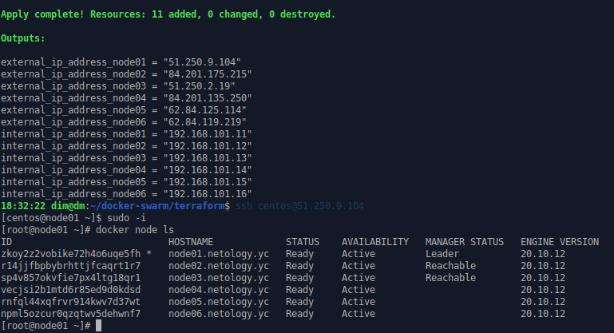
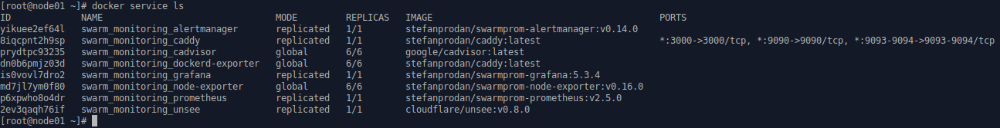
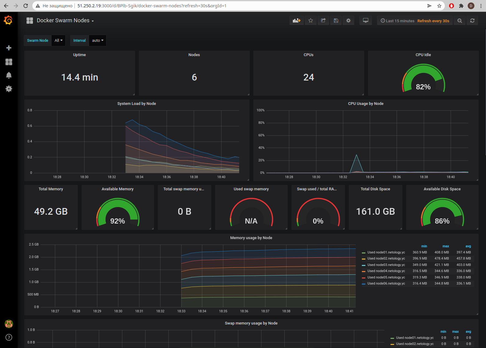

5.5. Оркестрация кластером Docker контейнеров на примере Docker Swarm - Дмитрий Щербаков

## Задача 1
### Дайте письменые ответы на следующие вопросы:
### - В чём отличие режимов работы сервисов в Docker Swarm кластере: replication и global?
В случае запуска сервиса в режиме `replication`, его функционирование осуществляется на заданном количестве нод кластера. При использовании режима `global`, на каждой ноде кластера запускается один экземпляр сервиса.
### - Какой алгоритм выбора лидера используется в Docker Swarm кластере?
Для выбора лидера используется алгоритм Raft.
### - Что такое Overlay Network?
Это виртуальные сети (технология VXLAN), работающие поверх существующей сетевой инфраструктуры и позволяющие взаимодействовать друг с другом узлам кластера Docker Swarm. 

## Задача 2

### Создать ваш первый Docker Swarm кластер в Яндекс.Облаке

### Для получения зачета, вам необходимо предоставить скриншот из терминала (консоли), с выводом команды:
```
docker node ls
```


## Задача 3

### Создать ваш первый, готовый к боевой эксплуатации кластер мониторинга, состоящий из стека микросервисов.

### Для получения зачета, вам необходимо предоставить скриншот из терминала (консоли), с выводом команды:
```
docker service ls
```





## Задача 4 (*)

### Выполнить на лидере Docker Swarm кластера команду (указанную ниже) и дать письменное описание её функционала, что она делает и зачем она нужна:
```
# см.документацию: https://docs.docker.com/engine/swarm/swarm_manager_locking/
docker swarm update --autolock=true
```

Результат выполнения команды:
```
[root@node01 ~]# docker node ls
ID                            HOSTNAME             STATUS    AVAILABILITY   MANAGER STATUS   ENGINE VERSION
zkoy2z2vobike72h4o6uqe5fh *   node01.netology.yc   Ready     Active         Leader           20.10.12
r14jjfbpbybrhttjfcaqrt1r7     node02.netology.yc   Ready     Active         Reachable        20.10.12
sp4v857okvfie7px4ltg18qr1     node03.netology.yc   Ready     Active         Reachable        20.10.12
vecjsi2b1mtd6r85ed9d0kdsd     node04.netology.yc   Ready     Active                          20.10.12
rnfql44xqfrvr914kwv7d37wt     node05.netology.yc   Ready     Active                          20.10.12
npml5ozcur0qzqtwv5dehwnf7     node06.netology.yc   Ready     Active                          20.10.12
[root@node01 ~]# docker swarm update --autolock=true
Swarm updated.
To unlock a swarm manager after it restarts, run the `docker swarm unlock`
command and provide the following key:

    SWMKEY-1-O3xGPlq37BDL9TrnNJmaAvNM5fVNTIUdUU2vc7t84ZU

Please remember to store this key in a password manager, since without it you
will not be able to restart the manager.
```
Данная команда включает режим блокировки TLS-ключей, используемых для шифрования сетевого взаимодействия между хостами Swarm-кластера и для шифрования журналов Raft. После включения данной блокировки, при перезапуске сервиса потребуется ручная разблокировка (`docker swarm unlock`) с использованием ключа, указанного в выводе команды выше (в данном случае, `SWMKEY-1-O3xGPlq37BDL9TrnNJmaAvNM5fVNTIUdUU2vc7t84ZU`).
