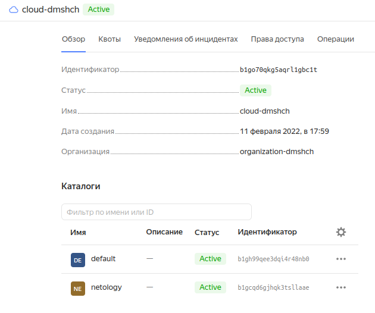

# 7.2. Облачные провайдеры и синтаксис Terraform. - Дмитрий Щербаков

## Задача 1 (Вариант с Yandex.Cloud). Регистрация в ЯО и знакомство с основами
### 1. Подробная инструкция на русском языке содержится здесь.
### 2. Обратите внимание на период бесплатного использования после регистрации аккаунта.
### 3. Используйте раздел "Подготовьте облако к работе" для регистрации аккаунта. Далее раздел "Настройте провайдер" для подготовки базового терраформ конфига.

```commandline
$ cat main.tf 
terraform {
  required_providers {
    yandex = {
      source = "yandex-cloud/yandex"
    }
  }
  required_version = ">= 0.13"
}

provider "yandex" {
  token     = "AQAAAAAxxxxxxxxxxxxxx7LC_M"
  cloud_id  = "b1go70qkg5aqrl1gbc1t"
  folder_id = "default"
  zone      = "ru-central1-a"
}


$ terraform init

Initializing the backend...

Initializing provider plugins...
- Finding latest version of yandex-cloud/yandex...
- Installing yandex-cloud/yandex v0.75.0...
- Installed yandex-cloud/yandex v0.75.0 (unauthenticated)

Terraform has created a lock file .terraform.lock.hcl to record the provider
selections it made above. Include this file in your version control repository
so that Terraform can guarantee to make the same selections by default when
you run "terraform init" in the future.

Terraform has been successfully initialized!

You may now begin working with Terraform. Try running "terraform plan" to see
any changes that are required for your infrastructure. All Terraform commands
should now work.

If you ever set or change modules or backend configuration for Terraform,
rerun this command to reinitialize your working directory. If you forget, other
commands will detect it and remind you to do so if necessary.
```
### 4. Воспользуйтесь инструкцией на сайте терраформа, что бы не указывать авторизационный токен в коде, а терраформ провайдер брал его из переменных окружений.
```commandline
dimka@dmhome:~/Nextcloud/Обмен/terraform/7.2$ ls -la
итого 12
drwxrwxr-x 2 dimka dimka 4096 июн 20 14:12 .
drwxrwxr-x 3 dimka dimka 4096 июн 20 13:42 ..
-rw-rw-r-- 1 dimka dimka  245 июн 20 14:12 main.tf
dimka@dmhome:~/Nextcloud/Обмен/terraform/7.2$ export YC_TOKEN="AQAAAAAxxxxxxxxxxxxxx7LC_M"
dimka@dmhome:~/Nextcloud/Обмен/terraform/7.2$ cat main.tf 
terraform {
  required_providers {
    yandex = {
      source = "yandex-cloud/yandex"
    }
  }
  required_version = ">= 0.13"
}

provider "yandex" {
  cloud_id  = "b1go70qkg5aqrl1gbc1t"
  folder_id = "default"
  zone      = "ru-central1-a"
}

dimka@dmhome:~/Nextcloud/Обмен/terraform/7.2$ terraform init

Initializing the backend...

Initializing provider plugins...
- Finding latest version of yandex-cloud/yandex...
- Installing yandex-cloud/yandex v0.75.0...
- Installed yandex-cloud/yandex v0.75.0 (unauthenticated)

Terraform has created a lock file .terraform.lock.hcl to record the provider
selections it made above. Include this file in your version control repository
so that Terraform can guarantee to make the same selections by default when
you run "terraform init" in the future.

Terraform has been successfully initialized!

You may now begin working with Terraform. Try running "terraform plan" to see
any changes that are required for your infrastructure. All Terraform commands
should now work.

If you ever set or change modules or backend configuration for Terraform,
rerun this command to reinitialize your working directory. If you forget, other
commands will detect it and remind you to do so if necessary.
dimka@dmhome:~/Nextcloud/Обмен/terraform/7.2$ ls -la
итого 20
drwxrwxr-x 3 dimka dimka 4096 июн 20 14:13 .
drwxrwxr-x 3 dimka dimka 4096 июн 20 13:42 ..
-rw-rw-r-- 1 dimka dimka  245 июн 20 14:12 main.tf
drwxr-xr-x 3 dimka dimka 4096 июн 20 14:13 .terraform
-rw-r--r-- 1 dimka dimka  258 июн 20 14:13 .terraform.lock.hcl
```

## Задача 2. Создание aws ec2 или yandex_compute_instance через терраформ.
### 1. В каталоге ```terraform``` вашего основного репозитория, который был создан в начале курсе, создайте файл ```main.tf``` и ```versions.tf```.
```commandline
$ ls ./
main.tf  versions.tf
```
### 2. Зарегистрируйте провайдер
```commandline
$ tree -a ./
./
├── main.tf
├── .terraform
│   └── providers
│       └── registry.terraform.io
│           └── yandex-cloud
│               └── yandex
│                   └── 0.75.0
│                       └── linux_amd64
│                           ├── CHANGELOG.md
│                           ├── LICENSE
│                           ├── README.md
│                           └── terraform-provider-yandex_v0.75.0
├── .terraform.lock.hcl
└── versions.tf

7 directories, 7 files
```
### 3. Внимание! В гит репозиторий нельзя пушить ваши личные ключи доступа к аккаунту. Поэтому в предыдущем задании мы указывали их в виде переменных окружения.
### 4. В файле main.tf воспользуйтесь блоком data "aws_ami для поиска ami образа последнего Ubuntu.
```commandline
$ yc compute image list --folder-id standard-images | grep -i ubuntu | grep 202206
| fd80ut9hsnv9aqrhvnlg | ubuntu-18-04-lts-vgpu-v20220613                                | ubuntu-1804-lts-vgpu                            | f2eqtonq033glt0ldddc           | READY  |
| fd84mnpg35f7s7b0f5lg | nat-instance-ubuntu-18-04-lts-v20220620                        | nat-instance-ubuntu                             | f2e9jq3vtnumunb22lge,          | READY  |
| fd87tirk5i8vitv9uuo1 | ubuntu-20-04-lts-v20220606                                     | ubuntu-2004-lts                                 | f2e8tnsqjeor74blquqc           | READY  |
| fd88q8cetpv706g8kia9 | ubuntu-18-04-lts-v20220613                                     | ubuntu-1804-lts                                 | f2el8bvfossqruqgt6sb           | READY  |
| fd8afts1qii2i1j0a7d0 | ubuntu-18-04-lts-gpu-a100-v20220620                            | ubuntu-1804-lts-a100                            | f2eeuj7ad3fgocn57pcn           | READY  |
| fd8bftvmg5dejgihkck8 | ubuntu-16-04-lts-v20220613                                     | ubuntu-1604-lts                                 | f2eoghuomi0nba7hvpb3           | READY  |
| fd8blpoo247b2s4bgltq | ubuntu-18-04-lts-vgpu-v20220606                                | ubuntu-1804-lts-vgpu                            | f2e7e5jnqalafhb3bu28           | READY  |
| fd8c358phhcfl700d7mf | ubuntu-18-04-lts-gpu-a100-v20220602                            | ubuntu-1804-lts-a100                            | f2ecdehqiehd8dpjgjbo           | READY  |
| fd8e4v5q2tsr3jo2ij1g | ubuntu-16-04-lts-v20220606                                     | ubuntu-1604-lts                                 | f2ej424892lmn3ucmsbq           | READY  |
| fd8f1tik9a7ap9ik2dg1 | ubuntu-20-04-lts-v20220620                                     | ubuntu-2004-lts                                 | f2eu4hp2k4r04d1usuh3           | READY  |
| fd8fh5he9b41fm3uuj1b | ubuntu-20-04-lts-gpu-a100-v20220606                            | ubuntu-2004-lts-a100                            | f2ehvtaktpen71lf32gh           | READY  |
| fd8h34rub6pjpg4qgi8j | ubuntu-18-04-lts-v20220606                                     | ubuntu-1804-lts                                 | f2esrqi3937cb7rsj9km           | READY  |
| fd8hf6ridd7v2ml5e45u | ubuntu-16-04-lts-v20220603                                     | ubuntu-1604-lts                                 | f2e5lqngknas98qhkosn           | READY  |
```
Здесь самым "свежим" является образ с ID fd8f1tik9a7ap9ik2dg1.

### 5. В файле main.tf создайте рессурс
### i. либо ec2 instance. Постарайтесь указать как можно больше параметров для его определения. Минимальный набор параметров указан в первом блоке Example Usage, но желательно, указать большее количество параметров.
### ii. либо yandex_compute_image.
```commandline
resource "yandex_compute_image" "ubuntu-image" {
  name       = "my-ubuntu-image"
  source_image = "fd8f1tik9a7ap9ik2dg1"
}
```
### 6. Также в случае использования aws:
### i. Добавьте data-блоки aws_caller_identity и aws_region.
### ii. В файл outputs.tf поместить блоки output с данными об используемых в данный момент:
### - AWS account ID,
### - AWS user ID,
### - AWS регион, который используется в данный момент,
### - Приватный IP ec2 инстансы,
### - Идентификатор подсети в которой создан инстанс.
```commandline
$ cat outputs.tf 
output "internal_ip_address_vm-1_yandex_cloud" {
  value = "${yandex_compute_instance.vm-1.network_interface.0.ip_address}"
}

output "external_ip_address_vm-1_yandex_cloud" {
  value = "${yandex_compute_instance.vm-1.network_interface.0.nat_ip_address}"
}
```

### 7. Если вы выполнили первый пункт, то добейтесь того, что бы команда terraform plan выполнялась без ошибок.
```commandline
$ terraform plan
yandex_compute_image.ubuntu-image: Refreshing state... [id=fd8k3fit4qmvrkbgaitl]
yandex_compute_instance.vm-1: Refreshing state... [id=fhmr0ra16op583kd0qfk]

Terraform used the selected providers to generate the following execution plan. Resource actions are indicated with the following symbols:
-/+ destroy and then create replacement

Terraform will perform the following actions:

  # yandex_compute_instance.vm-1 must be replaced
-/+ resource "yandex_compute_instance" "vm-1" {
      ~ created_at                = "2022-06-22T12:18:06Z" -> (known after apply)
      ~ folder_id                 = "b1gh99qee3dqi4r48nb0" -> (known after apply)
      ~ fqdn                      = "vm-1.ru-central1.internal" -> (known after apply)
      ~ id                        = "fhmr0ra16op583kd0qfk" -> (known after apply)
      - labels                    = {} -> null
        name                      = "terraform1"
      + service_account_id        = (known after apply)
      ~ status                    = "running" -> (known after apply)
      ~ zone                      = "ru-central1-a" -> (known after apply)
        # (5 unchanged attributes hidden)

      ~ boot_disk {
          ~ device_name = "fhmmj59cl6589o24ues5" -> (known after apply)
          ~ disk_id     = "fhmmj59cl6589o24ues5" -> (known after apply)
          ~ mode        = "READ_WRITE" -> (known after apply)
            # (1 unchanged attribute hidden)

          ~ initialize_params {
              ~ block_size  = 4096 -> (known after apply)
              + description = (known after apply)
                name        = "root-vm-1"
              + snapshot_id = (known after apply)
              ~ type        = "network-ssd" -> "network-nvme" # forces replacement
                # (2 unchanged attributes hidden)
            }
        }

      ~ network_interface {
          ~ index              = 0 -> (known after apply)
          ~ ip_address         = "10.128.0.19" -> (known after apply)
          ~ ipv6               = false -> (known after apply)
          + ipv6_address       = (known after apply)
          ~ mac_address        = "d0:0d:1b:06:d4:13" -> (known after apply)
          ~ nat_ip_address     = "51.250.81.227" -> (known after apply)
          ~ nat_ip_version     = "IPV4" -> (known after apply)
          ~ security_group_ids = [] -> (known after apply)
            # (3 unchanged attributes hidden)
        }

      ~ placement_policy {
          ~ host_affinity_rules = [] -> (known after apply)
          + placement_group_id  = (known after apply)
        }

      ~ resources {
          - gpus          = 0 -> null
            # (3 unchanged attributes hidden)
        }

      ~ scheduling_policy {
          ~ preemptible = false -> (known after apply)
        }
    }

Plan: 1 to add, 0 to change, 1 to destroy.

Changes to Outputs:
  ~ external_ip_address_vm-1_yandex_cloud = "51.250.81.227" -> (known after apply)
  ~ internal_ip_address_vm-1_yandex_cloud = "10.128.0.19" -> (known after apply)

─────────────────────────────────────────────────────────────────────────────────────────────────────────────────────────────────────────────────────────────────────────────────────────────────────────────────────────────────

Note: You didn't use the -out option to save this plan, so Terraform can't guarantee to take exactly these actions if you run "terraform apply" now.
```

## В качестве результата задания предоставьте:

### 1. Ответ на вопрос: при помощи какого инструмента (из разобранных на прошлом занятии) можно создать свой образ ami?
Свой образ можно создать при помощи Packer.
### 2. Ссылку на репозиторий с исходной конфигурацией терраформа.
https://github.com/DmShcherbakov/terraform-7.2
