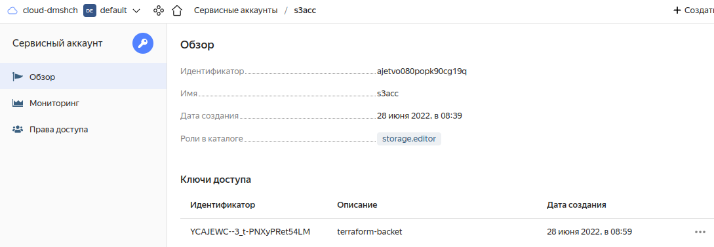

# 7.3. Основы и принцип работы Терраформ - Дмитрий Щербаков

## Задача 1. Создадим бэкэнд в S3 (необязательно, но крайне желательно).

### Если в рамках предыдущего задания у вас уже есть аккаунт AWS, то давайте продолжим знакомство со взаимодействием терраформа и aws. 
### 1. Создайте s3 бакет, iam роль и пользователя от которого будет работать терраформ. Можно создать отдельного пользователя, а можно использовать созданного в рамках предыдущего задания, просто добавьте ему необходимы права, как описано [здесь](https://www.terraform.io/docs/backends/types/s3.html).

### 2. Зарегистрируйте бэкэнд в терраформ проекте как описано по ссылке выше. 
```commandline
$ cat versions.tf 
terraform {
  required_providers {
    yandex = {
      source = "yandex-cloud/yandex"
    }
  }
  required_version = ">= 0.13"

  backend "s3" {
    endpoint   = "storage.yandexcloud.net"
    bucket     = "dmshch-backet-1"
    region     = "ru-central1-a"
    key        = "tfstate/dmshch-7.3.tfstate"
    access_key = "YCAxxxxxxxxxt54LM"
    secret_key = "YCOOP3xxxxxxxxxxxxxxxxxywOx4"
    skip_region_validation      = true
    skip_credentials_validation = true
  }

}
```


## Задача 2. Инициализируем проект и создаем воркспейсы. 

### 1. Выполните `terraform init`:
    * если был создан бэкэнд в S3, то терраформ создат файл стейтов в S3 и запись в таблице dynamodb.
    * иначе будет создан локальный файл со стейтами.
```commandline
$ terraform init

Initializing the backend...

Successfully configured the backend "s3"! Terraform will automatically
use this backend unless the backend configuration changes.

Initializing provider plugins...
- Finding latest version of yandex-cloud/yandex...
- Installing yandex-cloud/yandex v0.75.0...
- Installed yandex-cloud/yandex v0.75.0 (unauthenticated)

Terraform has created a lock file .terraform.lock.hcl to record the provider
selections it made above. Include this file in your version control repository
so that Terraform can guarantee to make the same selections by default when
you run "terraform init" in the future.

Terraform has been successfully initialized!

You may now begin working with Terraform. Try running "terraform plan" to see
any changes that are required for your infrastructure. All Terraform commands
should now work.

If you ever set or change modules or backend configuration for Terraform,
rerun this command to reinitialize your working directory. If you forget, other
commands will detect it and remind you to do so if necessary.
```

### 2. Создайте два воркспейса `stage` и `prod`.
```commandline
dimka@dmhome:~/Nextcloud/Обмен/terraform/7.3$ terraform workspace new stage
Created and switched to workspace "stage"!

You're now on a new, empty workspace. Workspaces isolate their state,
so if you run "terraform plan" Terraform will not see any existing state
for this configuration.
dimka@dmhome:~/Nextcloud/Обмен/terraform/7.3$ terraform workspace new prod
Created and switched to workspace "prod"!

You're now on a new, empty workspace. Workspaces isolate their state,
so if you run "terraform plan" Terraform will not see any existing state
for this configuration.
dimka@dmhome:~/Nextcloud/Обмен/terraform/7.3$ terraform workspace list
  default
* prod
  stage
```
### 3. В уже созданный `aws_instance` добавьте зависимость типа инстанса от вокспейса, что бы в разных ворскспейсах использовались разные `instance_type`.
Для Yandex.Cloud задал изменение количества ядер:
```commandline
dimka@dmhome:~/Nextcloud/Обмен/terraform/7.3$ cat variables.tf 
locals {
  cpu_count_map = {
    stage = "1"
    prod = "2"
  }
}
dimka@dmhome:~/Nextcloud/Обмен/terraform/7.3$ grep cpu_count_map main.tf 
    cores         = local.cpu_count_map[terraform.workspace]
dimka@dmhome:~/Nextcloud/Обмен/terraform/7.3$ terraform workspace list
  default
  prod
* stage

dimka@dmhome:~/Nextcloud/Обмен/terraform/7.3$ terraform plan | grep -A 4 resources
      + resources {
          + core_fraction = 5
          + cores         = 1
          + memory        = 2
        }
dimka@dmhome:~/Nextcloud/Обмен/terraform/7.3$ terraform workspace select prod
Switched to workspace "prod".
dimka@dmhome:~/Nextcloud/Обмен/terraform/7.3$ terraform plan | grep -A 4 resources
      + resources {
          + core_fraction = 5
          + cores         = 2
          + memory        = 2
        }
```
### 4. Добавим `count`. Для `stage` должен создаться один экземпляр `ec2`, а для `prod` два.
```commandline
dimka@dmhome:~/Nextcloud/Обмен/terraform/7.3$ cat variables.tf 
locals {
  cpu_count_map = {
    stage = "1"
    prod = "2"
  }
  instance_count_map = {
    stage = "1"
    prod = "2"
  }
}
dimka@dmhome:~/Nextcloud/Обмен/terraform/7.3$ grep instance_count_map main.tf 
  count = local.instance_count_map[terraform.workspace]
dimka@dmhome:~/Nextcloud/Обмен/terraform/7.3$ terraform workspace select stage
Switched to workspace "stage".
dimka@dmhome:~/Nextcloud/Обмен/terraform/7.3$ terraform plan | grep yandex_compute_instance.vm-1
  # yandex_compute_instance.vm-1[0] will be created
dimka@dmhome:~/Nextcloud/Обмен/terraform/7.3$ terraform workspace select prod
Switched to workspace "prod".
dimka@dmhome:~/Nextcloud/Обмен/terraform/7.3$ terraform plan | grep yandex_compute_instance.vm-1
  # yandex_compute_instance.vm-1[0] will be created
  # yandex_compute_instance.vm-1[1] will be created
```
### 5. Создайте рядом еще один `aws_instance`, но теперь определите их количество при помощи `for_each`, а не `count`.
```commandline
dimka@dmhome:~/Nextcloud/Обмен/terraform/7.3$ cat variables.tf 
locals {
...
  instance_set = {
    stage = toset(["1"])
    prod = toset(["1", "2", "3"])
  }
}

dimka@dmhome:~/Nextcloud/Обмен/terraform/7.3$ cat main.tf 
...
resource "yandex_compute_instance" "vm-2" {
  for_each = local.instance_set[terraform.workspace]
  name = "terraform-$each.key"
  description = "First test instance"
  hostname = "vm-2"
```
```commandline
dimka@dmhome:~/Nextcloud/Обмен/terraform/7.3$ terraform workspace select stage
Switched to workspace "stage".
dimka@dmhome:~/Nextcloud/Обмен/terraform/7.3$ terraform plan | grep vm-2
  # yandex_compute_instance.vm-2["1"] will be created
  + resource "yandex_compute_instance" "vm-2" {
      + hostname                  = "vm-2"
dimka@dmhome:~/Nextcloud/Обмен/terraform/7.3$ terraform workspace select prod
Switched to workspace "prod".
dimka@dmhome:~/Nextcloud/Обмен/terraform/7.3$ terraform plan | grep vm-2
  # yandex_compute_instance.vm-2["1"] will be created
  + resource "yandex_compute_instance" "vm-2" {
      + hostname                  = "vm-2"
  # yandex_compute_instance.vm-2["2"] will be created
  + resource "yandex_compute_instance" "vm-2" {
      + hostname                  = "vm-2"
  # yandex_compute_instance.vm-2["3"] will be created
  + resource "yandex_compute_instance" "vm-2" {
      + hostname                  = "vm-2"
```
### 6. Что бы при изменении типа инстанса не возникло ситуации, когда не будет ни одного инстанса добавьте параметр жизненного цикла `create_before_destroy = true` в один из рессурсов `aws_instance`.
```commandline
dimka@dmhome:~/Nextcloud/Обмен/terraform/7.3$ grep -A 3 lifecycle  main.tf
  lifecycle {
    create_before_destroy = "true"
  }

dimka@dmhome:~/Nextcloud/Обмен/terraform/7.3$ terraform validate
Success! The configuration is valid.
```
