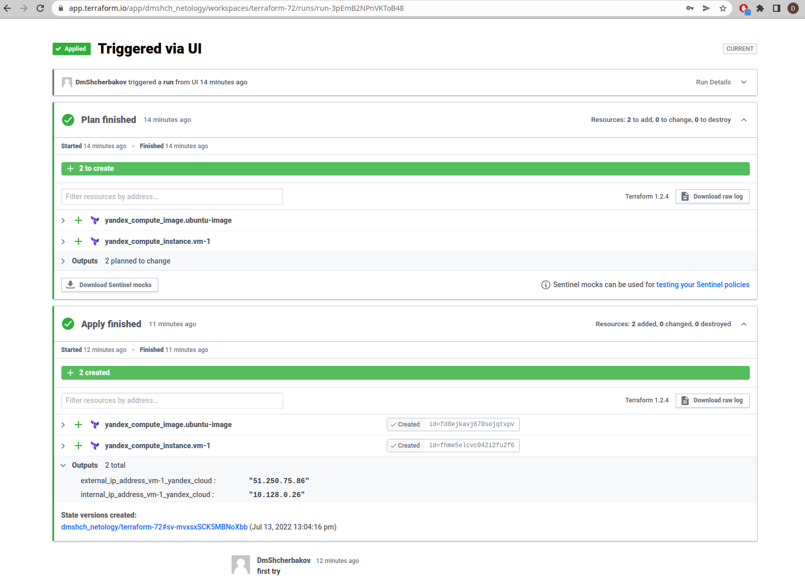
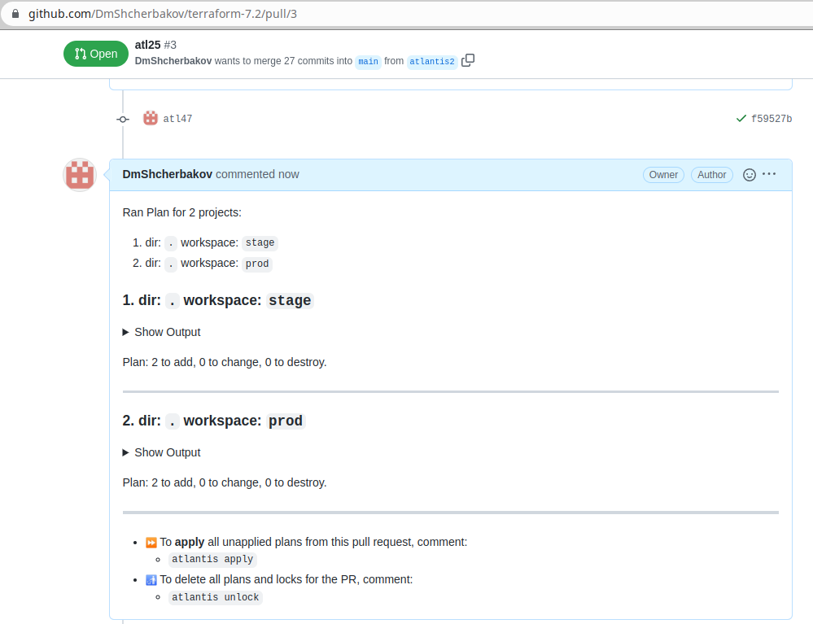

# 7.4. Средства командной работы над инфраструктурой. - Дмитрий Щербаков

## Задача 1. Настроить terraform cloud (необязательно, но крайне желательно).
### В этом задании предлагается познакомиться со средством командой работы над инфраструктурой предоставляемым разработчиками терраформа. 

### 1. Зарегистрируйтесь на [https://app.terraform.io/](https://app.terraform.io/). (регистрация бесплатная и не требует использования платежных инструментов).
### 2. Создайте в своем github аккаунте (или другом хранилище репозиториев) отдельный репозиторий с конфигурационными файлами прошлых занятий (или воспользуйтесь любым простым конфигом).
### 3. Зарегистрируйте этот репозиторий в [https://app.terraform.io/](https://app.terraform.io/).
### 4. Выполните plan и apply. 
### В качестве результата задания приложите снимок экрана с успешным применением конфигурации.


## Задача 2. Написать серверный конфиг для атлантиса. 

### Смысл задания – познакомиться с документацией 
### о [серверной](https://www.runatlantis.io/docs/server-side-repo-config.html) конфигурации и конфигурации уровня 
 [репозитория](https://www.runatlantis.io/docs/repo-level-atlantis-yaml.html).

### Создай `server.yaml` который скажет атлантису:
### 1. Укажите, что атлантис должен работать только для репозиториев в вашем github (или любом другом) аккаунте.
### 2. На стороне клиентского конфига разрешите изменять `workflow`, то есть для каждого репозитория можно будет указать свои дополнительные команды. 
### 3. В `workflow` используемом по-умолчанию сделайте так, что бы во время планирования не происходил `lock` состояния.
Конфигурация была разделена мною на два файла, запуск сервиса производился командой:
```commandline
atlantis server --config server.yaml --repo-config repos.yaml
```
Соответственно, ссылки на файлы:
[server.yaml](atlantis/server.yaml)
[repos.yaml](atlantis/repos.yaml)

### Создай `atlantis.yaml` который, если поместить в корень terraform проекта, скажет атлантису:
### 1. Надо запускать планирование и аплай для двух воркспейсов `stage` и `prod`.
### 2. Необходимо включить автопланирование при изменении любых файлов `*.tf`.
### В качестве результата приложите ссылку на файлы `server.yaml` и `atlantis.yaml`.
Ссылка на файл [atlantis.yaml](atlantis.yaml)

Результат работы представлен на скриншоте:


## Задача 3. Знакомство с каталогом модулей. 

### 1. В [каталоге модулей](https://registry.terraform.io/browse/modules) найдите официальный модуль от aws для создания `ec2` инстансов. 
### 2. Изучите как устроен модуль. Задумайтесь, будете ли в своем проекте использовать этот модуль или непосредственно ресурс `aws_instance` без помощи модуля?
В ряде случаев, когда требуется создать большое количество схожих экземпляров ресурсов, использование модулей крайне оправдано.
### 3. В рамках предпоследнего задания был создан ec2 при помощи ресурса `aws_instance`. 
### Создайте аналогичный инстанс при помощи найденного модуля.   

### В качестве результата задания приложите ссылку на созданный блок конфигураций. 
С учетом недоступности AWS, мной был выбран модуль `hamnsk/vpc/yandex` для работы с Yandex.Cloud, который создает необходимыю сетевую конфигурацию.
Результат применения конфигурации выглядит так:
```commandline
...
module.vpc.yandex_vpc_network.this: Creating...
module.vpc.yandex_vpc_network.this: Creation complete after 3s [id=enp1nd65sfpb9aeja41q]
module.vpc.yandex_vpc_subnet.this["ru-central1-c"]: Creating...
module.vpc.yandex_vpc_subnet.this["ru-central1-b"]: Creating...
module.vpc.yandex_vpc_subnet.this["ru-central1-a"]: Creating...
module.vpc.yandex_vpc_subnet.this["ru-central1-a"]: Creation complete after 1s [id=e9bi25btjocsd7ddfejt]
module.vpc.yandex_vpc_subnet.this["ru-central1-b"]: Creation complete after 2s [id=e2lg6tegg218k0uj5fhs]
module.vpc.yandex_vpc_subnet.this["ru-central1-c"]: Creation complete after 3s [id=b0cnp0b82g7ggc4j0uff]

Apply complete! Resources: 4 added, 0 changed, 0 destroyed.
```
Файл конфигурации доступен по [ссылке](main.tf)