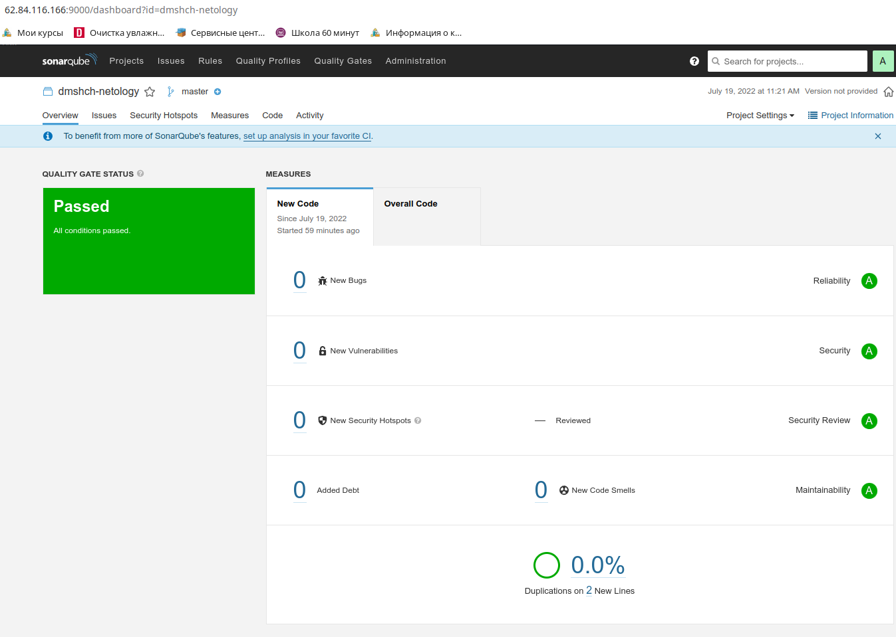

# 09.03 CI\CD - Дмитрий Щербаков

## Подготовка к выполнению

### 1. Создаём 2 VM в yandex cloud со следующими параметрами: 2CPU 4RAM Centos7(остальное по минимальным требованиям)

### 2. Прописываем в [inventory](./infrastructure/inventory/cicd/hosts.yml) [playbook'a](./infrastructure/site.yml) созданные хосты
```commandline
$ cat inventory/cicd/hosts.yml 
---
all:
  hosts:
    sonar-01:
      ansible_host: 62.84.116.166
    nexus-01:
      ansible_host: 62.84.116.116
  children:
    sonarqube:
      hosts:
        sonar-01:
    nexus:
      hosts:
        nexus-01:
    postgres:
      hosts:
        sonar-01:
  vars:
    ansible_connection_type: ssh
    ansible_user: dim
```
### 3. Добавляем в [files](./infrastructure/files/) файл со своим публичным ключом (id_rsa.pub). Если ключ называется иначе - найдите таску в плейбуке, которая использует id_rsa.pub имя и исправьте на своё
```commandline
$ ls -l files/id_rsa.pub 
-rw-r--r-- 1 dimka dimka 566 окт 31  2021 files/id_rsa.pub
```
### 4. Запускаем playbook, ожидаем успешного завершения
На задании `Reboot VM` плэйбук стопорился, несмотря на то, что виртуальная машина перезагружалась (и размер виртуальной памяти увеличивался). Для успешного продолжения данную таску на повторный проход отключил.
```commandline
PLAY RECAP ********************************************************************************************************************************************************************************************************************************************************************
nexus-01                   : ok=17   changed=11   unreachable=0    failed=0    skipped=2    rescued=0    ignored=0   
sonar-01                   : ok=31   changed=8    unreachable=0    failed=0    skipped=3    rescued=0    ignored=0   
```
### 5. Проверяем готовность Sonarqube через [браузер](http://localhost:9000)

### 6. Заходим под admin\admin, меняем пароль на свой
### 7.  Проверяем готовность Nexus через [бразуер](http://localhost:8081)

### 8. Подключаемся под admin\admin123, меняем пароль, сохраняем анонимный доступ

## Знакомоство с SonarQube

### Основная часть

### 1. Создаём новый проект, название произвольное
### 2. Скачиваем пакет sonar-scanner, который нам предлагает скачать сам sonarqube
### 3. Делаем так, чтобы binary был доступен через вызов в shell (или меняем переменную PATH или любой другой удобный вам способ)
### 4. Проверяем `sonar-scanner --version`
```commandline
$ sonar-scanner --version
INFO: Scanner configuration file: /home/dimka/Nextcloud/Обмен/cicd/mnt-homeworks/09-ci-03-cicd/sonar-scanner-4.7.0.2747-linux/conf/sonar-scanner.properties
INFO: Project root configuration file: NONE
INFO: SonarScanner 4.7.0.2747
INFO: Java 11.0.14.1 Eclipse Adoptium (64-bit)
INFO: Linux 5.4.0-122-lowlatency amd64
```
### 5. Запускаем анализатор против кода из директории [example](./example) с дополнительным ключом `-Dsonar.coverage.exclusions=fail.py`
```commandline
$ sonar-scanner -Dsonar.coverage.exclusions=fail.py -Dsonar.login=2c02dcxxxxxxxxxxxxb3f83 -Dsonar.projectKey=dmshch-netology
INFO: Scanner configuration file: /home/dimka/Nextcloud/Обмен/cicd/mnt-homeworks/09-ci-03-cicd/sonar-scanner-4.7.0.2747-linux/conf/sonar-scanner.properties
INFO: Project root configuration file: NONE
INFO: SonarScanner 4.7.0.2747
INFO: Java 11.0.14.1 Eclipse Adoptium (64-bit)
INFO: Linux 5.4.0-122-lowlatency amd64
INFO: User cache: /home/dimka/.sonar/cache
INFO: Scanner configuration file: /home/dimka/Nextcloud/Обмен/cicd/mnt-homeworks/09-ci-03-cicd/sonar-scanner-4.7.0.2747-linux/conf/sonar-scanner.properties
INFO: Project root configuration file: NONE
INFO: Analyzing on SonarQube server 9.1.0
INFO: Default locale: "ru_RU", source code encoding: "UTF-8"
INFO: Load global settings
INFO: Load global settings (done) | time=106ms
INFO: Server id: 9CFC3560-AYIVFeBYqWoDUFxGiaXn
INFO: User cache: /home/dimka/.sonar/cache
INFO: Load/download plugins
INFO: Load plugins index
INFO: Load plugins index (done) | time=57ms
INFO: Load/download plugins (done) | time=117ms
INFO: Process project properties
INFO: Process project properties (done) | time=1ms
INFO: Execute project builders
INFO: Execute project builders (done) | time=1ms
INFO: Project key: dmshch-netology
INFO: Base dir: /home/dimka/Nextcloud/Обмен/cicd/mnt-homeworks/09-ci-03-cicd/example
INFO: Working dir: /home/dimka/Nextcloud/Обмен/cicd/mnt-homeworks/09-ci-03-cicd/example/.scannerwork
INFO: Load project settings for component key: 'dmshch-netology'
INFO: Load project settings for component key: 'dmshch-netology' (done) | time=50ms
INFO: Load quality profiles
INFO: Load quality profiles (done) | time=103ms
INFO: Load active rules
INFO: Load active rules (done) | time=3178ms
INFO: Indexing files...
INFO: Project configuration:
INFO:   Excluded sources for coverage: fail.py
INFO: 1 file indexed
INFO: 0 files ignored because of scm ignore settings
INFO: Quality profile for py: Sonar way
INFO: ------------- Run sensors on module dmshch-netology
INFO: Load metrics repository
INFO: Load metrics repository (done) | time=71ms
INFO: Sensor Python Sensor [python]
WARN: Your code is analyzed as compatible with python 2 and 3 by default. This will prevent the detection of issues specific to python 2 or python 3. You can get a more precise analysis by setting a python version in your configuration via the parameter "sonar.python.version"
INFO: Starting global symbols computation
INFO: 1 source file to be analyzed
INFO: Load project repositories
INFO: Load project repositories (done) | time=33ms
INFO: 1/1 source file has been analyzed
INFO: Starting rules execution
INFO: 1 source file to be analyzed
INFO: 1/1 source file has been analyzed
INFO: Sensor Python Sensor [python] (done) | time=563ms
INFO: Sensor Cobertura Sensor for Python coverage [python]
INFO: Sensor Cobertura Sensor for Python coverage [python] (done) | time=8ms
INFO: Sensor PythonXUnitSensor [python]
INFO: Sensor PythonXUnitSensor [python] (done) | time=1ms
INFO: Sensor CSS Rules [cssfamily]
INFO: No CSS, PHP, HTML or VueJS files are found in the project. CSS analysis is skipped.
INFO: Sensor CSS Rules [cssfamily] (done) | time=1ms
INFO: Sensor JaCoCo XML Report Importer [jacoco]
INFO: 'sonar.coverage.jacoco.xmlReportPaths' is not defined. Using default locations: target/site/jacoco/jacoco.xml,target/site/jacoco-it/jacoco.xml,build/reports/jacoco/test/jacocoTestReport.xml
INFO: No report imported, no coverage information will be imported by JaCoCo XML Report Importer
INFO: Sensor JaCoCo XML Report Importer [jacoco] (done) | time=3ms
INFO: Sensor C# Project Type Information [csharp]
INFO: Sensor C# Project Type Information [csharp] (done) | time=1ms
INFO: Sensor C# Analysis Log [csharp]
INFO: Sensor C# Analysis Log [csharp] (done) | time=11ms
INFO: Sensor C# Properties [csharp]
INFO: Sensor C# Properties [csharp] (done) | time=0ms
INFO: Sensor JavaXmlSensor [java]
INFO: Sensor JavaXmlSensor [java] (done) | time=1ms
INFO: Sensor HTML [web]
INFO: Sensor HTML [web] (done) | time=2ms
INFO: Sensor VB.NET Project Type Information [vbnet]
INFO: Sensor VB.NET Project Type Information [vbnet] (done) | time=1ms
INFO: Sensor VB.NET Analysis Log [vbnet]
INFO: Sensor VB.NET Analysis Log [vbnet] (done) | time=12ms
INFO: Sensor VB.NET Properties [vbnet]
INFO: Sensor VB.NET Properties [vbnet] (done) | time=0ms
INFO: ------------- Run sensors on project
INFO: Sensor Zero Coverage Sensor
INFO: Sensor Zero Coverage Sensor (done) | time=1ms
INFO: SCM Publisher SCM provider for this project is: git
INFO: SCM Publisher 1 source file to be analyzed
INFO: SCM Publisher 1/1 source file have been analyzed (done) | time=339ms
INFO: CPD Executor Calculating CPD for 1 file
INFO: CPD Executor CPD calculation finished (done) | time=8ms
INFO: Analysis report generated in 71ms, dir size=103,1 kB
INFO: Analysis report compressed in 11ms, zip size=14,4 kB
INFO: Analysis report uploaded in 55ms
INFO: ANALYSIS SUCCESSFUL, you can browse http://62.84.116.166:9000/dashboard?id=dmshch-netology
INFO: Note that you will be able to access the updated dashboard once the server has processed the submitted analysis report
INFO: More about the report processing at http://62.84.116.166:9000/api/ce/task?id=AYIVW44pTN4t2LqzdjMA
INFO: Analysis total time: 6.401 s
INFO: ------------------------------------------------------------------------
INFO: EXECUTION SUCCESS
INFO: ------------------------------------------------------------------------
INFO: Total time: 7.293s
INFO: Final Memory: 8M/37M
INFO: ------------------------------------------------------------------------
```
### 6. Смотрим результат в интерфейсе

### 7. Исправляем ошибки, которые он выявил(включая warnings)
```commandline
$ cat fail.py 
index = 0
def increment(index):
    index += 1
    return index
def get_square(numb):
    return numb*numb
def print_numb(numb):
    print("Number is {}".format(numb))

while (index < 10):
    index = increment(index)
    print(get_square(index))
```
Warnings предписывают конкретнее указать для какой версии Python осуществляется проверка (для уточнения, используется параметр `sonar.python.version`), а также осуществляет проверку комментариев об авторстве и коммите (для ее отключение используется параметр `sonar.scm.disabled=true`).
### 8. Запускаем анализатор повторно - проверяем, что QG пройдены успешно
```commandline
$ sonar-scanner -Dsonar.coverage.exclusions=fail.py -Dsonar.login=2c02dc4d15416a39450ae6c8a61ba54b147b3f83 -Dsonar.projectKey=dmshch-netology -Dsonar.python.version=3 -Dsonar.scm.disabled=true
...
INFO: ANALYSIS SUCCESSFUL, you can browse http://62.84.116.166:9000/dashboard?id=dmshch-netology
INFO: Note that you will be able to access the updated dashboard once the server has processed the submitted analysis report
INFO: More about the report processing at http://62.84.116.166:9000/api/ce/task?id=AYIVjHpJTN4t2LqzdjMP
INFO: Analysis total time: 2.870 s
INFO: ------------------------------------------------------------------------
INFO: EXECUTION SUCCESS
INFO: ------------------------------------------------------------------------
INFO: Total time: 3.729s
INFO: Final Memory: 7M/34M
INFO: ------------------------------------------------------------------------
```
### 9. Делаем скриншот успешного прохождения анализа, прикладываем к решению ДЗ


## Знакомство с Nexus

### Основная часть

### 1. В репозиторий `maven-public` загружаем артефакт с GAV параметрами:
###     1. groupId: netology
###    2. artifactId: java
###    3. version: 8_282
###    4. classifier: distrib
###    5. type: tar.gz
### 2. В него же загружаем такой же артефакт, но с version: 8_102
### 3. Проверяем, что все файлы загрузились успешно

### 4. В ответе присылаем файл `maven-metadata.xml` для этого артефекта
```commandline
$ cat maven-metadata.xml 
<?xml version="1.0" encoding="UTF-8"?>
<metadata modelVersion="1.1.0">
  <groupId>netology</groupId>
  <artifactId>java</artifactId>
  <versioning>
    <latest>8_282</latest>
    <release>8_282</release>
    <versions>
      <version>8_102</version>
      <version>8_282</version>
    </versions>
    <lastUpdated>20220719090332</lastUpdated>
  </versioning>
</metadata>
```

### Знакомство с Maven

### Подготовка к выполнению

### 1. Скачиваем дистрибутив с [maven](https://maven.apache.org/download.cgi)
### 2. Разархивируем, делаем так, чтобы binary был доступен через вызов в shell (или меняем переменную PATH или любой другой удобный вам способ)
### 3. Удаляем из `apache-maven-<version>/conf/settings.xml` упоминание о правиле, отвергающем http соединение( раздел mirrors->id: my-repository-http-unblocker)
```commandline
$ grep -i -c unblocker conf/settings.xml 
0
```
Для нормальной работы закомментирован следующий блок:
```commandline
<!--    <mirror>
      <id>maven-default-http-blocker</id>
      <mirrorOf>external:http:*</mirrorOf>
      <name>Pseudo repository to mirror external repositories initially using HTTP.</name>
      <url>http://0.0.0.0/</url>
      <blocked>true</blocked>
    </mirror>
-->
```
### 4. Проверяем `mvn --version`
```commandline
$ mvn --version
Apache Maven 3.8.6 (84538c9988a25aec085021c365c560670ad80f63)
Maven home: /home/dimka/Загрузки/apache-maven-3.8.6
Java version: 11, vendor: Oracle Corporation, runtime: /opt/jdk-11
Default locale: ru_RU, platform encoding: UTF-8
OS name: "linux", version: "5.4.0-122-lowlatency", arch: "amd64", family: "unix"
```
### 5. Забираем директорию [mvn](./mvn) с pom


### Основная часть

### 1. Меняем в `pom.xml` блок с зависимостями под наш артефакт из первого пункта задания для Nexus (java с версией 8_282)
### 2. Запускаем команду `mvn package` в директории с `pom.xml`, ожидаем успешного окончания
```commandline
$ mvn package
...
INFO] Building jar: /home/dimka/Nextcloud/Обмен/cicd/mnt-homeworks/09-ci-03-cicd/mvn/target/simple-app-1.0-SNAPSHOT.jar
[INFO] ------------------------------------------------------------------------
[INFO] BUILD SUCCESS
[INFO] ------------------------------------------------------------------------
[INFO] Total time:  6.774 s
[INFO] Finished at: 2022-07-19T12:28:28+03:00
[INFO] ------------------------------------------------------------------------
```
### 3. Проверяем директорию `~/.m2/repository/`, находим наш артефакт
```commandline
$ tree ~/.m2/repository/netology/
/home/dimka/.m2/repository/netology/
└── java
    └── 8_282
        ├── java-8_282-distrib.tar.gz
        ├── java-8_282-distrib.tar.gz.sha1
        ├── java-8_282.pom.lastUpdated
        └── _remote.repositories

2 directories, 4 files
```
### 4. В ответе присылаем исправленный файл `pom.xml`
```commandline
$ cat pom.xml 
<project xmlns="http://maven.apache.org/POM/4.0.0" xmlns:xsi="http://www.w3.org/2001/XMLSchema-instance"
  xsi:schemaLocation="http://maven.apache.org/POM/4.0.0 http://maven.apache.org/xsd/maven-4.0.0.xsd">
  <modelVersion>4.0.0</modelVersion>
 
  <groupId>com.netology.app</groupId>
  <artifactId>simple-app</artifactId>
  <version>1.0-SNAPSHOT</version>
   <repositories>
    <repository>
      <id>my-repo</id>
      <name>maven-public</name>
      <url>http://62.84.116.116:8081/repository/maven-public/</url>
    </repository>
  </repositories>
  <dependencies>
     <dependency>
      <groupId>netology</groupId>
      <artifactId>java</artifactId>
      <version>8_282</version>
      <classifier>distrib</classifier>
      <type>tar.gz</type>
    </dependency>
  </dependencies>
</project>
```
