# 09.06 Gitlab - Дмитрий Щербаков

## Подготовка к выполнению

### 1. Необходимо [подготовить gitlab к работе по инструкции](https://cloud.yandex.ru/docs/tutorials/infrastructure-management/gitlab-containers)
### 2. Создайте свой новый проект
### 3. Создайте новый репозиторий в gitlab, наполните его [файлами](./repository)
### 4. Проект должен быть публичным, остальные настройки по желанию
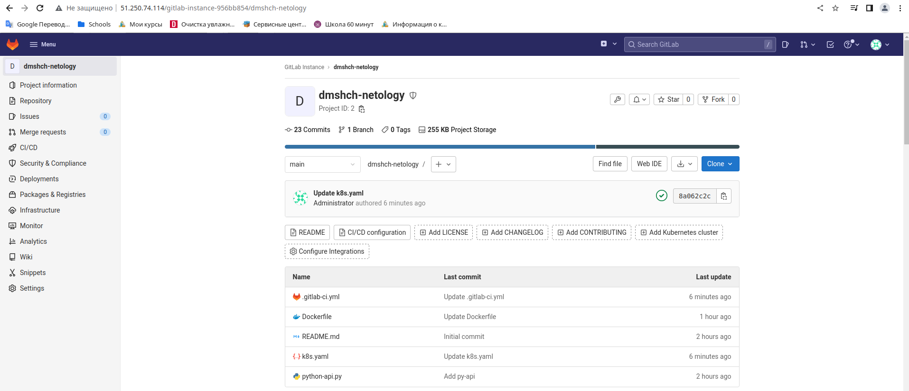

## Основная часть

### DevOps

### В репозитории содержится код проекта на python. Проект - RESTful API сервис. Ваша задача автоматизировать сборку образа с выполнением python-скрипта:
### 1. Образ собирается на основе [centos:7](https://hub.docker.com/_/centos?tab=tags&page=1&ordering=last_updated)
### 2. Python версии не ниже 3.7
### 3. Установлены зависимости: `flask` `flask-jsonpify` `flask-restful`
### 4. Создана директория `/python_api`
### 5. Скрипт из репозитория размещён в /python_api
### 6. Точка вызова: запуск скрипта
Сожержимое Dockerfile:
```commandline
FROM centos:7
RUN yum install python3 python3-pip -y
RUN pip3 install flask flask-restful flask-jsonpify
COPY python-api.py /python_api/
CMD ["python3", "/python_api/python-api.py"]
```
7. Если сборка происходит на ветке `master`: должен подняться pod kubernetes на основе образа `python-api`, иначе этот шаг нужно пропустить
Содержимое .gitlab-ci.yml:
```commandline
stages:
  - build
  - deploy
build:
  stage: build
  script:
    - docker login --username iam --password $IAMT cr.yandex
    - docker build . -t cr.yandex/crp5qjp7tue5se155qlh/dmshch:gitlab-$CI_COMMIT_SHORT_SHA
    - docker push cr.yandex/crp5qjp7tue5se155qlh/dmshch:gitlab-$CI_COMMIT_SHORT_SHA
deploy:
  image: gcr.io/cloud-builders/kubectl:latest
  stage: deploy
  script:
    - kubectl config set-cluster k8s --server="$KUBE_URL" --insecure-skip-tls-verify=true
    - kubectl config set-credentials admin --token="$KUBE_TOKEN"
    - kubectl config set-context default --cluster=k8s --user=admin
    - kubectl config use-context default
    - sed -i "s/__VERSION__/gitlab-$CI_COMMIT_SHORT_SHA/" k8s.yaml
    - kubectl apply -f k8s.yaml
  only:
    - main
```
Результат работы:
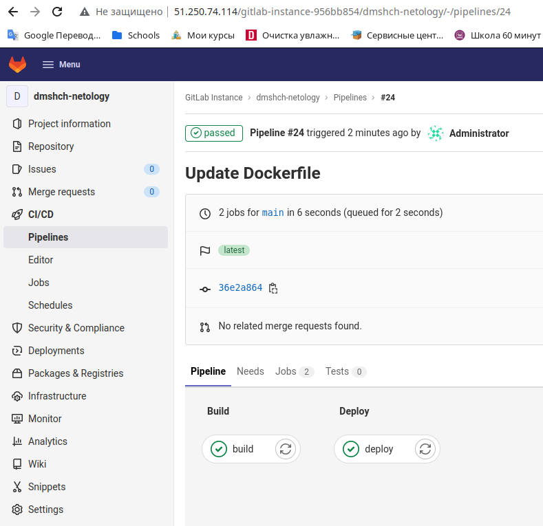

Job build:
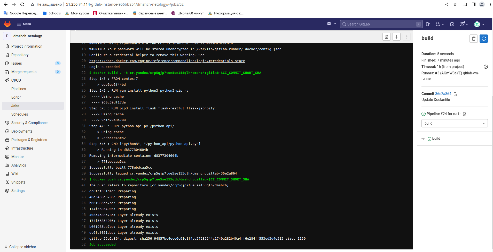

Job deploy:
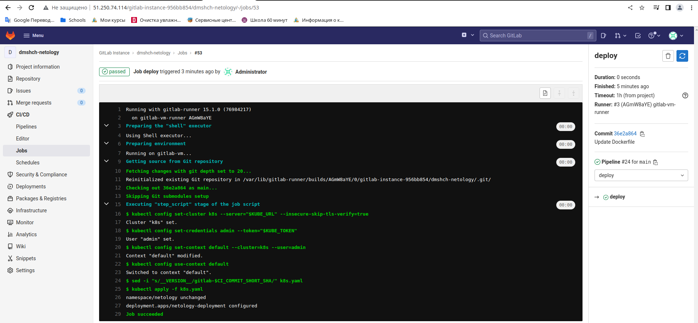

Сожержимое реестра:
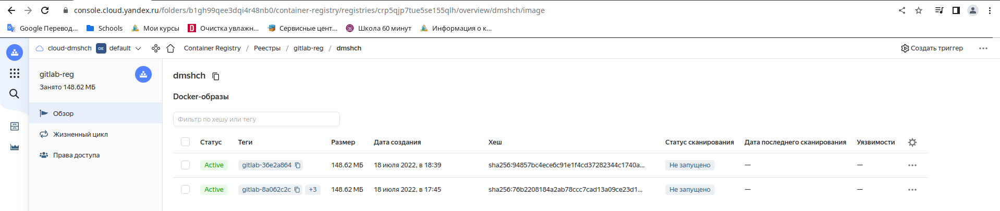

Лог пода:
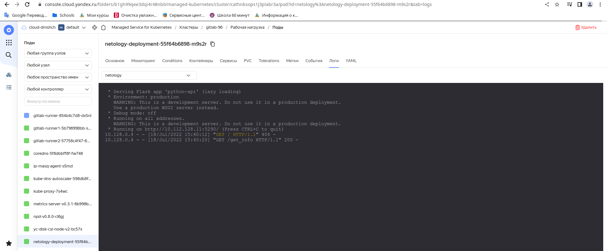

Результат обращения к сервису с хоста gitlab:
```commandline
dim@gitlab-vm:~$ curl http://10.112.128.11:5290/get_info
{"version": 3, "method": "GET", "message": "Already started"}
```

### Product Owner

### Вашему проекту нужна бизнесовая доработка: необходимо поменять JSON ответа на вызов метода GET `/rest/api/get_info`, необходимо создать Issue в котором указать:
### 1. Какой метод необходимо исправить
### 2. Текст с `{ "message": "Already started" }` на `{ "message": "Running"}`
### 3. Issue поставить label: feature
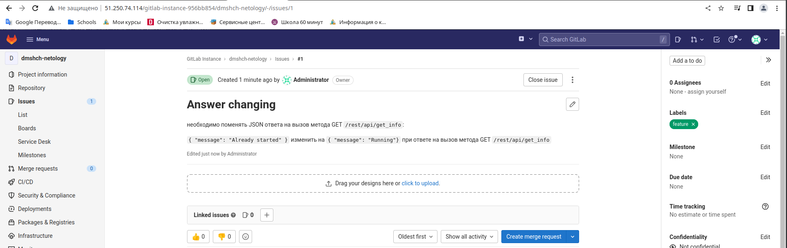

### Developer

### Вам пришел новый Issue на доработку, вам необходимо:
### 1. Создать отдельную ветку, связанную с этим issue
### 2. Внести изменения по тексту из задания
Измененный текст сервиса
```commandline
from flask import Flask, request
from flask_restful import Resource, Api
from json import dumps
from flask_jsonpify import jsonify
app = Flask(__name__)
api = Api(app)
class Info(Resource):
    def get(self):
        return {'version': 3, 'method': 'GET', 'message': 'Already started'}
class Info2(Resource):
    def get(self):
        return {'version': 3, 'method': 'GET', 'message': 'Running'}
api.add_resource(Info, '/get_info')
api.add_resource(Info2, '/rest/api/get_info')
if __name__ == '__main__':
     app.run(host='0.0.0.0', port='5290')
```
3. Подготовить Merge Requst, влить необходимые изменения в `master`, проверить, что сборка прошла успешно
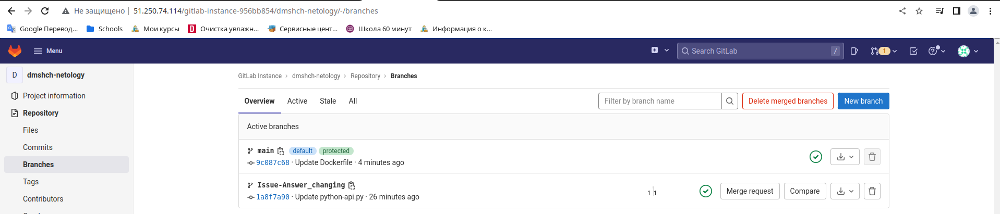

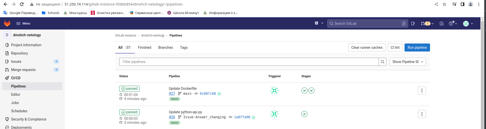


### Tester

### Разработчики выполнили новый Issue, необходимо проверить валидность изменений:
### 1. Поднять докер-контейнер с образом `python-api:latest` и проверить возврат метода на корректность
Ранее имя контейнера не оговаривалось, поэтому к данному заданию исправил название с `dmshch` на `python-api` в файлах `.gitlab-ci.yml` и `k8s.yaml`.
На странице с заданиями видно, что билду из созданной ветки соответствует идентификатор 10eae380:
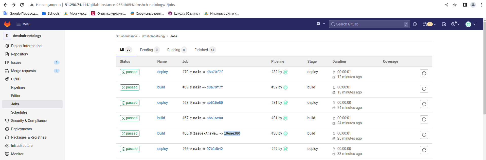. Соответственно, можно запустить образ с данным идентификатором на локальной станции и отследить реакцию на внешние воздействия:
```commandline
# docker run cr.yandex/crp5qjp7tue5se155qlh/python-api:gitlab-10eae380
Unable to find image 'cr.yandex/crp5qjp7tue5se155qlh/python-api:gitlab-10eae380' locally
gitlab-10eae380: Pulling from crp5qjp7tue5se155qlh/python-api
2d473b07cdd5: Already exists 
dbfb666ca9e7: Already exists 
000da25a5ca9: Already exists 
0652ce07df6a: Pull complete 
Digest: sha256:69a19de7de341d6d3d12c48dbd2abe6c1978506c7c460d08358b188c6a3d3033
Status: Downloaded newer image for cr.yandex/crp5qjp7tue5se155qlh/python-api:gitlab-10eae380
 * Serving Flask app 'python-api' (lazy loading)
 * Environment: production
   WARNING: This is a development server. Do not use it in a production deployment.
   Use a production WSGI server instead.
 * Debug mode: off
 * Running on all addresses.
   WARNING: This is a development server. Do not use it in a production deployment.
 * Running on http://172.17.0.2:5290/ (Press CTRL+C to quit)
172.17.0.1 - - [18/Jul/2022 17:24:26] "GET /rest/api/get_info HTTP/1.1" 200 -
172.17.0.1 - - [18/Jul/2022 17:24:29] "GET /get_info HTTP/1.1" 200 -
```
Подключаясь из другой консоли, видим:
```commandline
dimka@dmhome:~$ curl http://172.17.0.2:5290/rest/api/get_info
{"version": 3, "method": "GET", "message": "Running"}
dimka@dmhome:~$ curl http://172.17.0.2:5290/get_info
{"version": 3, "method": "GET", "message": "Already started"}
```
### 3. Закрыть Issue с комментарием об успешности прохождения, указав желаемый результат и фактически достигнутый
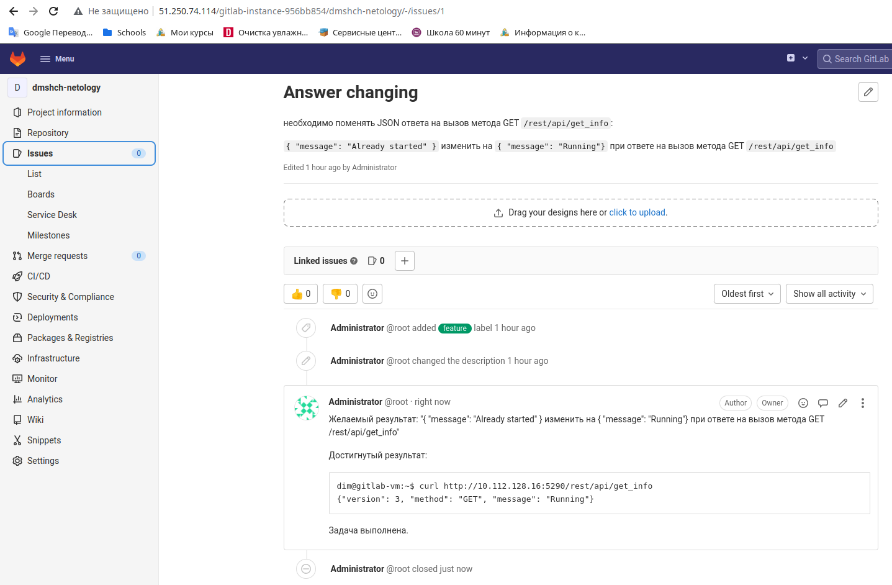
После слияния веток, автоматически произведен деплой в кластер k8s:
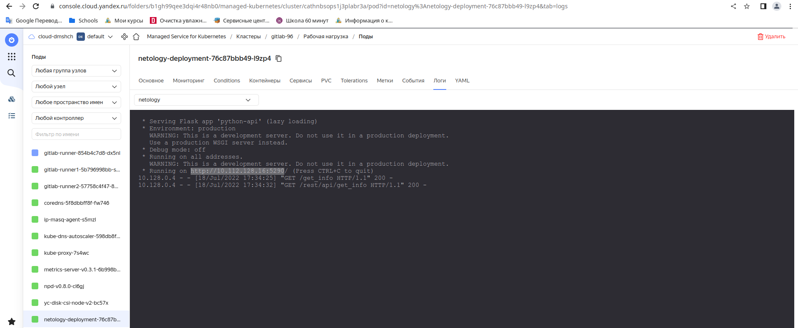
Результат проверки с сервера gitlab:
```commandline
dim@gitlab-vm:~$ curl http://10.112.128.16:5290/get_info
{"version": 3, "method": "GET", "message": "Already started"}
dim@gitlab-vm:~$ curl http://10.112.128.16:5290/rest/api/get_info
{"version": 3, "method": "GET", "message": "Running"}
```
## Итог

После успешного прохождения всех ролей - отправьте ссылку на ваш проект в гитлаб, как решение домашнего задания

### :bangbang: Не забудьте оставить GitLab рабочим после выполнения задания и погасить все ресурсы в Yandex.Cloud сразу после получения зачета по домашнему заданию.
По достигнутой с куратором договоренности, для экономии бюджета на ЯО, прикладываю скриншоты и отладочную информацию.